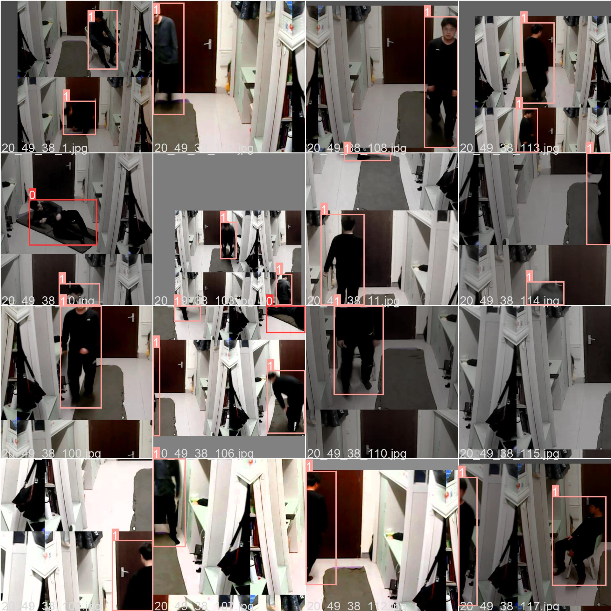
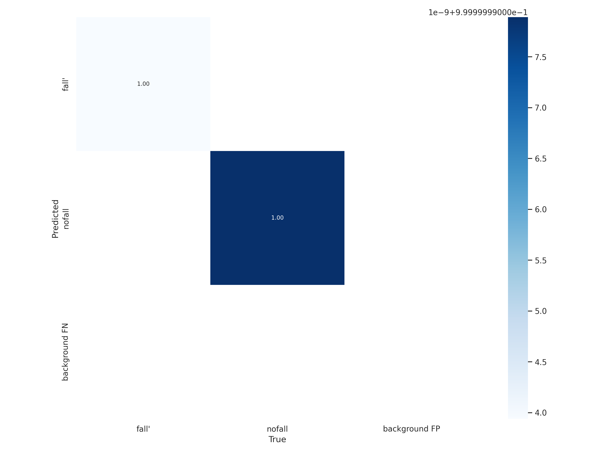
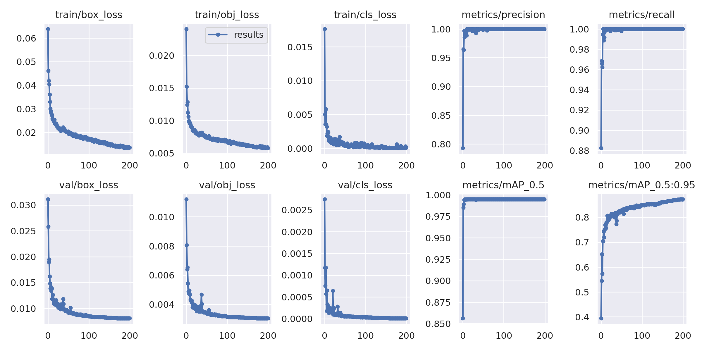
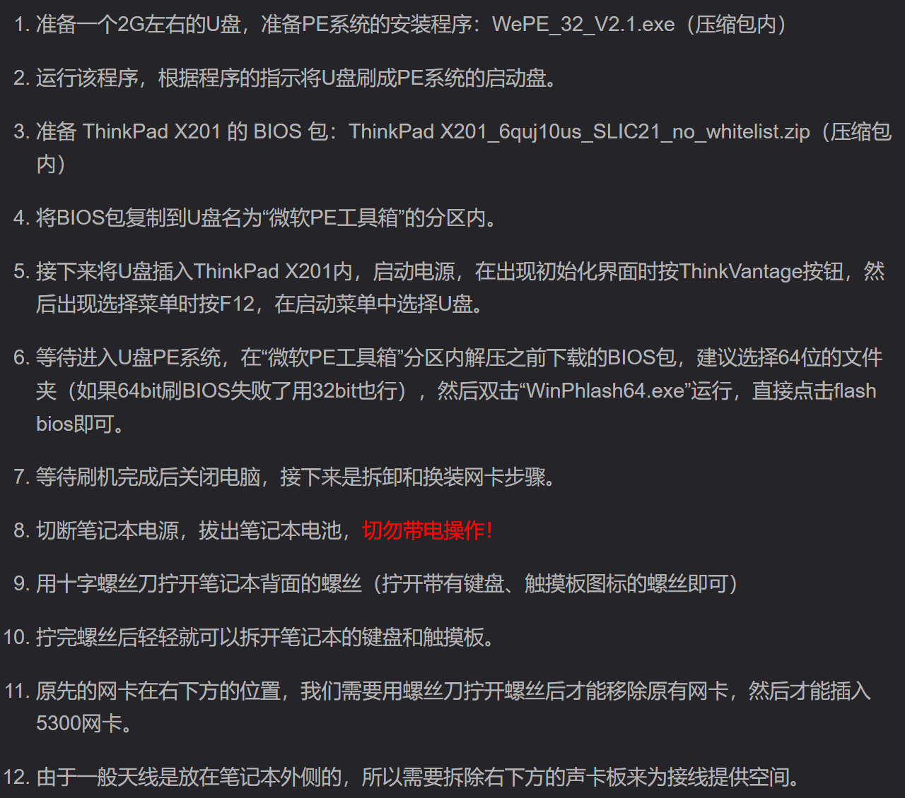
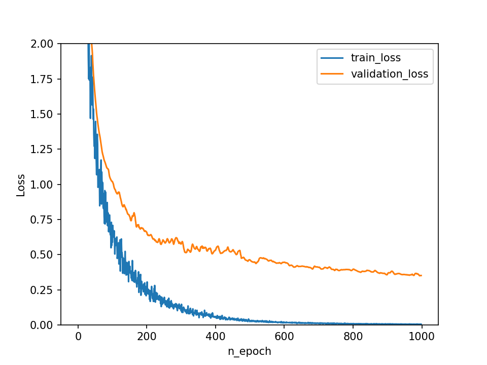
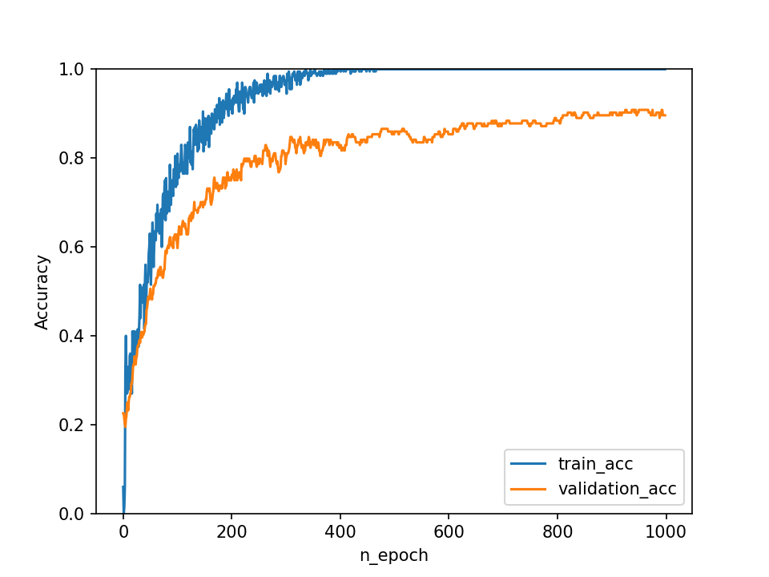

# 摄像头和Wifi融合的室内摔倒检测系统      

##  Video_Detection文件夹

该文件夹为USB单目摄像头视频采集并检测的主要文件夹，可实现yolov5模型的训练、测试，数据集采用视频帧提取，标注工具采用 labelimg。该文件夹需要的。

### 所需环境

cuda 10.0、python 3.7、pytorch 1.7.1，部分安装命令如下：

```
pip install torch==1.7.1 torchvision==0.8.2 -f https://download.pytorch.org/whl/torch_stable.html -i  https://pypi.tuna.tsinghua.edu.cn/simple/
pip install numpy
pip install matplotlib
pip install pandas
pip install scipy
pip install seaborn
pip install opencv-python
pip install tqdm
pip install pillow
pip install tensorboard -i https://pypi.tuna.tsinghua.edu.cn/simple
pip install pyyaml  -i https://pypi.tuna.tsinghua.edu.cn/simple
pip install pandas
pip install scikit-image -i https://pypi.tuna.tsinghua.edu.cn/simple
pip install Cython
pip install thop -i https://pypi.tuna.tsinghua.edu.cn/simple
pip install pycocotools
```

### 工程构建

1、需要下载原作者的 yolov5 代码，https://github.com/ultralytics/yolov5

2、模型权重文件有yolov5l,yolov5m,yolov5s等几种，本项目采用yolov5x.pt进行训练，将yolov5x.pt放在weights文件夹中

3、在data文件夹下面创建下面四个文件夹：Annotations、images、ImageSets、labels

4、创建 makeTex.py 文件，用于将标注文件（XML文件）划分为训练集、验证集和测试集。分计算划分比例、获取所有XML文件、计算划分数量、随机抽样、写入文件、关闭文件等几步。

5、创建voc_label.py文件，用于将XML格式的标注文件转换为训练模型所需的格式，并且生成一个包含图像文件路径的列表。

6、在主目录下创建文件夹runs，在runs文件夹下面创建文件夹detect、train

7、所有前期准备已经完成，获取摔倒数据集准备训练，数据集获取详见后面数据集生成部分

8、在data文件夹中找到coco.yaml,复制coco.yaml文件在同目录下黏贴换一个名为fall.yaml文件

9、修改fall.yaml文件内容，包括类别数和类别名

```
# Classes
nc: 2  # number of classes
names: [fall', 'nofall',]  # class names
```

10、找到models文件夹下的yolov5x.yaml文件，修改yolov5x.yaml中的类别数

```
nc: 2  # number of classes
depth_multiple: 1.33  # model depth multiple
width_multiple: 1.25  # layer channel multiple
```

11、依次运行makeTxt.py文件、voc_label.py文件

12、找到train.py文件，在train.py文件中按照下图的修改前三个路径

```
parser.add_argument('--weights', type=str, default= 'weights/yolov5x.pt', help='initial weights path')
parser.add_argument('--cfg', type=str, default='models/yolov5x.yaml', help='model.yaml path')
parser.add_argument('--data', type=str, default='data/fall.yaml', help='dataset.yaml path')
```

并运行train.py文件，训练好的模型存在于/runs/train/exp/weights路径

13.找到detect.py文件，修改detect.py文件的模型路径和运行的视频素材路径

```
parser.add_argument('--weights', nargs='+', type=str, default='weights/best.pt', help='model path(s)')
parser.add_argument('--source', type=str, default='15_51_5.mp4', help='file/dir/URL/glob, 0 for webcam')
```

运行的时候没有展示，会直接生成视频保存在runs下的detect文件夹下

### 数据集生成

使用/video_capture/video_time.py调用摄像头采集一段视频，之后使用/video_capture/video_frame.py将视频切割为图片，然后利用labelimg为图片打标签，生成xml文件，注意图片和标签的名字要相同，最后将生成的图片数据放置于data/images，将标签放置于data/Annotations，该步骤应该在工程构建的第7步同步进行。

### 结果展示








## CSI_Drive文件夹

该文件夹下存放了用于linux下配置网卡驱动并获取CSI信息的文件。

### 硬件设备

1. 电脑设备推荐ThinkPad X201
2. 网卡务必使用**Intel 5300**网卡

### 刷BIOS & 拆卸替换网卡

由于ThinkPad X201电脑的BIOS版本比较旧，因此我之前直接换装网卡之后在BIOS启动阶段就出错了，提示无法识别的硬件设备。因此我们需要在换装网卡之前利用Win PE系统刷一遍BIOS，具体操作如下：



### 操作系统

操作系统推荐Ubuntu 14.06 LTS，内核版本为3.13。如果你能在安装系统的界面成功检测到周围的WIFI并且能连接成功，那说明BIOS刷机成功了，系统能够识别这款网卡

### 内核编译、驱动、固件配置

1、安装相关依赖

更新源

```
sudo apt-get update
```

下载安装依赖包

```
sudo apt-get -y install git-core kernel-package fakeroot build-essential ncurses-dev
sudo apt-get -y install libnl-dev libssl-dev
sudo apt-get -y install iw
```

2、下载、编译内核

准备 intel-5300-csi-github-master.tar.gz

解压、编译

按顺序一步一步在终端执行以下代码

```
cd ~
tar -xvf intel-5300-csi-github-master.tar.gz
cd intel-5300-csi-github-master
make oldconfig # 一直按回车
make menuconfig # 在弹出的窗口选择Save，再Exit，一定要save一遍，而不是直接退出。另外可能会因为终端窗口比较小无法显示完全而报错
make -j4 # 编译内核一直都比较慢，大概半小时到一小时
sudo make install modules_install # 安装kernel module，大约15分钟
sudo make install
sudo make install modules_install # 再次安装内核模块（保险起见，一定要执行）
sudo mkinitramfs -o /boot/initrd.img-`cat include/config/kernel.release` `cat include/config/kernel.release`
make headers_install
sudo mkdir /usr/src/linux-headers-`cat include/config/kernel.release`
sudo cp -rf usr/include /usr/src/linux-headers-`cat include/config/kernel.release`/include
```

添加刚刚编译过的内核（4.2.0版本）至启动项

```
cd /etc/default 
sudo vi grub
```

注释这一行

```
GRUB_HIDDEN_TIMEOUT=0
```

更新grub

```
sudo update-grub
```

重启电脑，**一定**要在启动选项中选择4.2的内核版本进入。

3、替换固件

按顺序在终端执行以下代码

```
cd ~
git clone https://github.com/dhalperi/linux-80211n-csitool-supplementary.git
for file in /lib/firmware/iwlwifi-5000-*.ucode; do sudo mv $file $file.orig; done
sudo cp linux-80211n-csitool-supplementary/firmware/iwlwifi-5000-2.ucode.sigcomm2010 /lib/firmware/
sudo ln -s iwlwifi-5000-2.ucode.sigcomm2010 /lib/firmware/iwlwifi-5000-2.ucode
```

到此，5300网卡的驱动以及CSI收发包工具都已经配置完毕。接下来分别介绍发包和收包的操作。

### 具体使用

#### 1、共同准备

```
cd ~
sudo apt-get install libpcap-dev
git clone https://github.com/dhalperi/lorcon-old.git
cd lorcon-old
./configure
make
sudo make install
```

#### 2、CSI发送端

（1）编译发送代码

```
cd ~
cd linux-80211n-csitool-supplementary/injection/
make
```

（2）执行初始化脚本 inject.sh

在执行之前建议先用 iwconfig 查看无线网卡接口名称，一般情况下是 wlan0

执行脚本即参数配置：

```
sudo bash ./inject.sh wlan0 64 HT20
```

参数解释：第一个参数是无线网卡接口名称，一般是wlan0，第二个参数是信道编号，建议64，第三个是OFDM下的HT20模式

（3）发送数据

```
echo 0x1c113 | sudo tee `sudo find /sys -name monitor_tx_rate`
cd ~
cd linux-80211n-csitool-supplementary/injection/
sudo ./random_packets 1000000000 100 1 1000
```

random_packets的参数解释：第一个参数是累计发包数量，第二个参数是包的大小，第三个参数1代表injection MAC，用1就可以了，最后一个参数代表每隔1000微秒发一次包，即一秒发1000个包。

#### 3、CSI接收端

（1）编译接收代码

```
cd ~
cd linux-80211n-csitool-supplementary/netlink/
make
```

（2）执行初始化脚本 monitor.sh 

注意：一定要采用这个脚本，其他博客上的脚本基本缺少了第2、3行内容，否则收不到包的！

```
sudo bash ./monitor.sh wlan0 64 HT20
```

信道编号要和发送端的一样

（3）执行收包程序

```
cd ~
cd linux-80211n-csitool-supplementary/netlink/
sudo ./log_to_file temp # temp是保存数据的文件名，强烈建议文件名改为dat后缀
```

上述代码只能不停的收包，log_to_file.c可以实现收包n秒以后自动停止。

使用方法如下：

```
cd ~
cd linux-80211n-csitool-supplementary/netlink/
sudo ./log_to_file temp 3
```

参数解释：temp是保存数据的文件名，3代表从检测到CSI包之后收3秒，然后退出程序。如果发送端每秒发送1000个包，那么在不丢包的情况下可以收到3000个包。

### CSI数据处理

可以采用Matlab或Python对数据进行处理，Matlab更权威。matlab方法如下：

1. 下载Matlab处理dat文件的代码包。（压缩包内：01 dat_to_csi_mat.zip）

2. 运行代码包内的data_to_csi.m脚本。

   

## Wifi_Detection文件夹

该文件夹内包含了数据预处理、模型训练、调用模型的文件，数据集采用的是csi tools 采集的dat文件，可利用datafile_convert_final文件夹下的Activity_datfile_to_csvfile 和 interp_filename_change_for_input_3文件对文件类型进行转换。

### 各文件的作用

cross_vali_data_convert_merge_pred.py是用于数据预处理操作的，具体来说，它从CSV文件中读取数据，然后将数据分割成固定大小的窗口，并将这些窗口保存到新的CSV文件中。

cross_vali_input_data_train.py定义了一个名为 `DataSet` 的类，用于处理和提供数据批次，以及一个名为 `csv_import` 的函数，用于从CSV文件中导入数据。

cross_vali_recurrent_network_wifi_activity.py实现了一个基于TensorFlow的循环神经网络（RNN）模型，用于对WiFi活动数据进行分类。代码中包含了数据导入、模型定义、训练过程和评估过程。RNN模型中使用了一层LSTM块，隐藏层特征数量为200，遗忘门偏置项为1.0.

predict_5_cls.py用于加载一个预先训练好的TensorFlow模型，并使用该模型对新的数据进行预测。主要包括加载模型、设置输入和输出节点、以及执行预测操作。

### 结果展示





## Result_Display文件夹

该文件夹下存放了一些测试结果，包括yolov5测试结果和整个软件系统的测试结果。

## Others文件夹

该文件夹并没有实际用于项目中，只是记录了在项目进行中的一些尝试和测试，该文件夹下包含pycode、Vgg_classfy两个文件夹，pycode文件夹下的文件是一个简单的视频接收服务器的实现，使用Python的socket库和OpenCV库，通过监听指定端口，接收来自客户端发送的视频帧，并将每帧视频显示出来。


；Vgg_classfy文件夹用于vgg16网络处理一维CSI信息，其中同样包含网络训练和预测的功能，训练数据采用csv类型。

## 相关参考

https://blog.csdn.net/liaoqingjian/article/details/118927478

https://blog.csdn.net/James_Bond_slm/article/details/117432357

