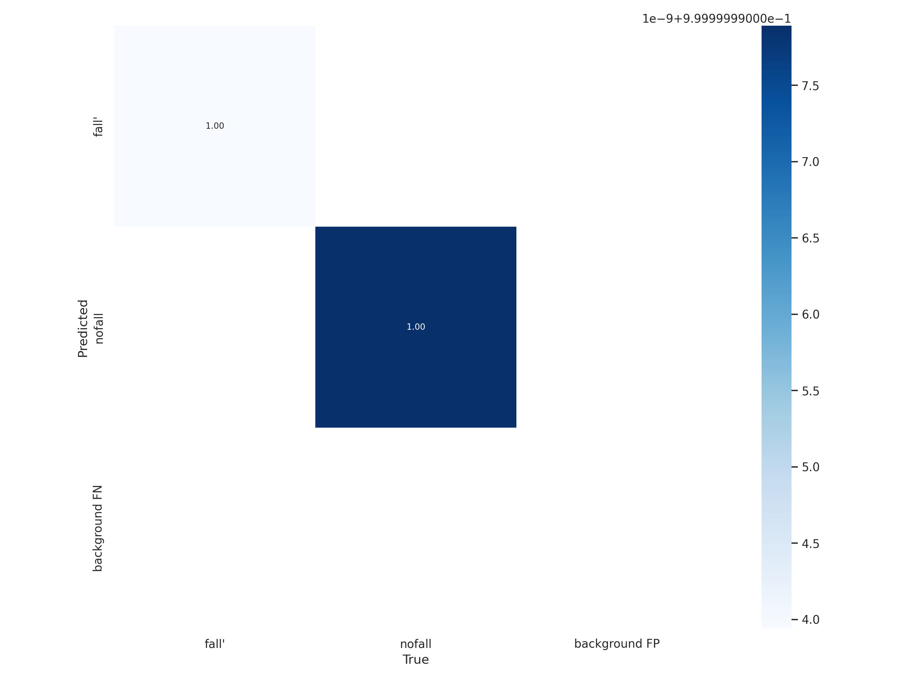
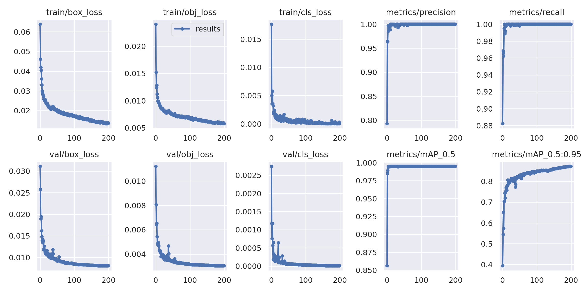
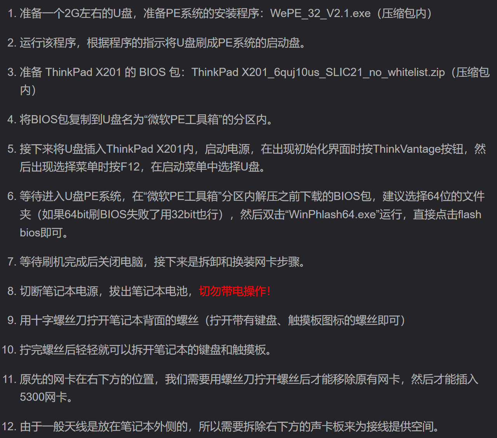
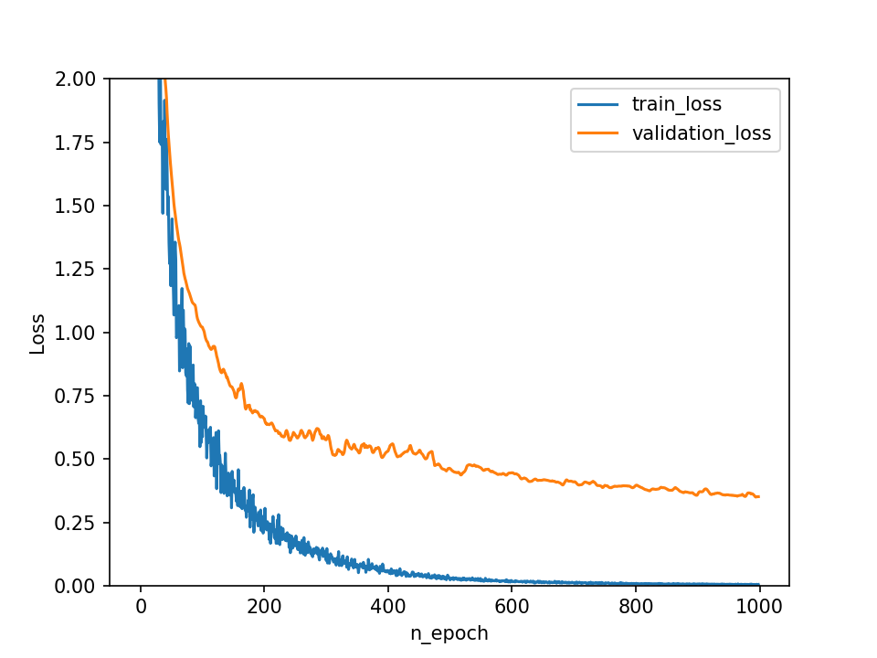
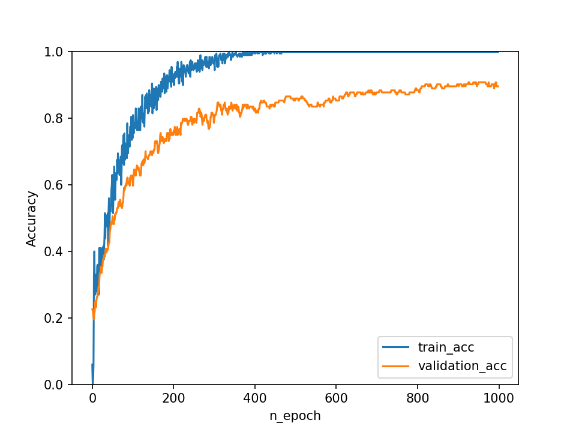
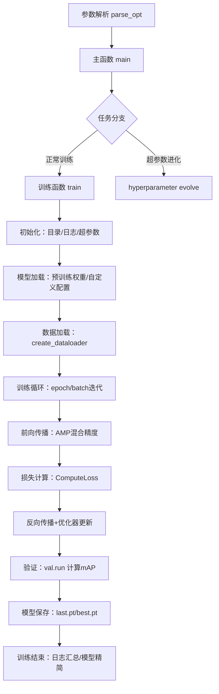
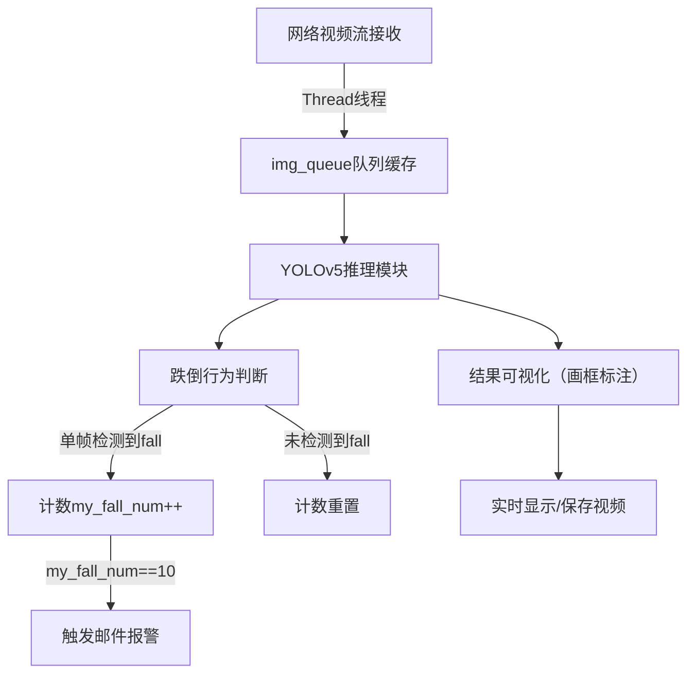
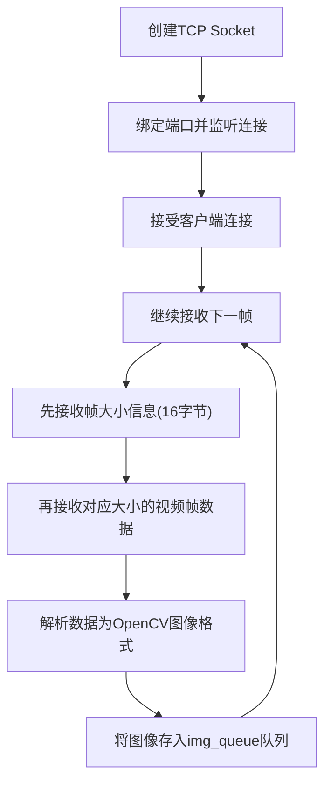
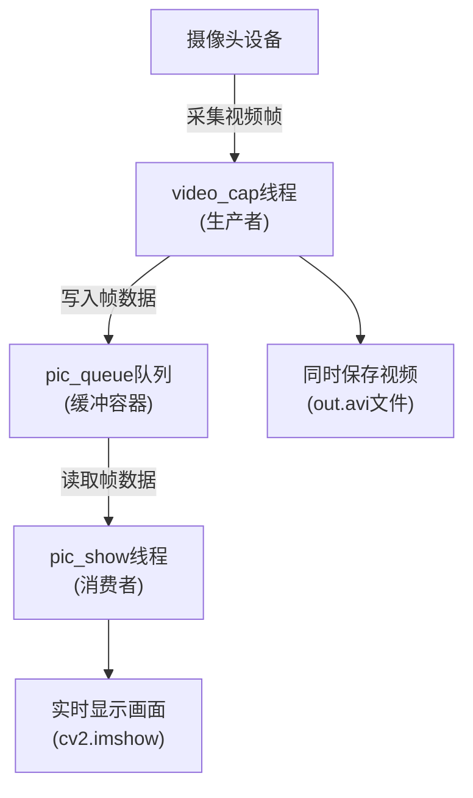
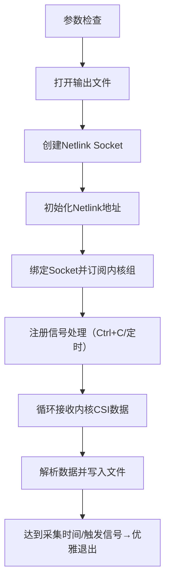

# 摄像头和Wifi融合的室内摔倒检测系统      

##  Video_Detection文件夹

该文件夹为USB单目摄像头视频采集并检测的主要文件夹，可实现yolov5模型的训练、测试，数据集采用视频帧提取，标注工具采用 labelimg。该文件夹需要的。

### 所需环境

cuda 10.0、python 3.7、pytorch 1.7.1，部分安装命令如下：

```
pip install torch==1.7.1 torchvision==0.8.2 -f https://download.pytorch.org/whl/torch_stable.html -i  https://pypi.tuna.tsinghua.edu.cn/simple/
pip install numpy
pip install matplotlib
pip install pandas
pip install scipy
pip install seaborn
pip install opencv-python
pip install tqdm
pip install pillow
pip install tensorboard -i https://pypi.tuna.tsinghua.edu.cn/simple
pip install pyyaml  -i https://pypi.tuna.tsinghua.edu.cn/simple
pip install pandas
pip install scikit-image -i https://pypi.tuna.tsinghua.edu.cn/simple
pip install Cython
pip install thop -i https://pypi.tuna.tsinghua.edu.cn/simple
pip install pycocotools
```

### 工程构建

1、需要下载原作者的 yolov5 代码，https://github.com/ultralytics/yolov5

2、模型权重文件有yolov5l,yolov5m,yolov5s等几种，本项目采用yolov5x.pt进行训练，将yolov5x.pt放在weights文件夹中

3、在data文件夹下面创建下面四个文件夹：Annotations、images、ImageSets、labels

4、创建 makeTex.py 文件，用于将标注文件（XML文件）划分为训练集、验证集和测试集。分计算划分比例、获取所有XML文件、计算划分数量、随机抽样、写入文件、关闭文件等几步。

5、创建voc_label.py文件，用于将XML格式的标注文件转换为训练模型所需的格式，并且生成一个包含图像文件路径的列表。

6、在主目录下创建文件夹runs，在runs文件夹下面创建文件夹detect、train

7、所有前期准备已经完成，获取摔倒数据集准备训练，数据集获取详见后面数据集生成部分

8、在data文件夹中找到coco.yaml,复制coco.yaml文件在同目录下黏贴换一个名为fall.yaml文件

9、修改fall.yaml文件内容，包括类别数和类别名

```
# Classes
nc: 2  # number of classes
names: [fall', 'nofall',]  # class names
```

10、找到models文件夹下的yolov5x.yaml文件，修改yolov5x.yaml中的类别数

```
nc: 2  # number of classes
depth_multiple: 1.33  # model depth multiple
width_multiple: 1.25  # layer channel multiple
```

11、依次运行makeTxt.py文件、voc_label.py文件

12、找到train.py文件，在train.py文件中按照下图的修改前三个路径

```
parser.add_argument('--weights', type=str, default= 'weights/yolov5x.pt', help='initial weights path')
parser.add_argument('--cfg', type=str, default='models/yolov5x.yaml', help='model.yaml path')
parser.add_argument('--data', type=str, default='data/fall.yaml', help='dataset.yaml path')
```

并运行train.py文件，训练好的模型存在于/runs/train/exp/weights路径

13.找到detect.py文件，修改detect.py文件的模型路径和运行的视频素材路径

```
parser.add_argument('--weights', nargs='+', type=str, default='weights/best.pt', help='model path(s)')
parser.add_argument('--source', type=str, default='15_51_5.mp4', help='file/dir/URL/glob, 0 for webcam')
```

运行的时候没有展示，会直接生成视频保存在runs下的detect文件夹下

14.若将模型部署至服务器，则须运行serve_video.py和video_client.py来开启数据的传输

### 数据集生成

使用/video_capture/video_time.py调用摄像头采集一段视频，之后使用/video_capture/video_frame.py将视频切割为图片，然后利用labelimg为图片打标签，生成xml文件，注意图片和标签的名字要相同，最后将生成的图片数据放置于data/images，将标签放置于data/Annotations，该步骤应该在工程构建的第7步同步进行。

### 结果展示







## CSI_Drive文件夹

该文件夹下存放了用于linux下配置网卡驱动并获取CSI信息的文件。

### 硬件设备

1. 电脑设备推荐ThinkPad X201
2. 网卡务必使用**Intel 5300**网卡

### 刷BIOS & 拆卸替换网卡

由于ThinkPad X201电脑的BIOS版本比较旧，因此我之前直接换装网卡之后在BIOS启动阶段就出错了，提示无法识别的硬件设备。因此我们需要在换装网卡之前利用Win PE系统刷一遍BIOS，具体操作如下：



### 操作系统

操作系统推荐Ubuntu 14.06 LTS，内核版本为3.13。如果你能在安装系统的界面成功检测到周围的WIFI并且能连接成功，那说明BIOS刷机成功了，系统能够识别这款网卡

### 内核编译、驱动、固件配置

1、安装相关依赖

更新源

```
sudo apt-get update
```

下载安装依赖包

```
sudo apt-get -y install git-core kernel-package fakeroot build-essential ncurses-dev
sudo apt-get -y install libnl-dev libssl-dev
sudo apt-get -y install iw
```

2、下载、编译内核

准备 intel-5300-csi-github-master.tar.gz

解压、编译

按顺序一步一步在终端执行以下代码

```
cd ~
tar -xvf intel-5300-csi-github-master.tar.gz
cd intel-5300-csi-github-master
make oldconfig # 一直按回车
make menuconfig # 在弹出的窗口选择Save，再Exit，一定要save一遍，而不是直接退出。另外可能会因为终端窗口比较小无法显示完全而报错
make -j4 # 编译内核一直都比较慢，大概半小时到一小时
sudo make install modules_install # 安装kernel module，大约15分钟
sudo make install
sudo make install modules_install # 再次安装内核模块（保险起见，一定要执行）
sudo mkinitramfs -o /boot/initrd.img-`cat include/config/kernel.release` `cat include/config/kernel.release`
make headers_install
sudo mkdir /usr/src/linux-headers-`cat include/config/kernel.release`
sudo cp -rf usr/include /usr/src/linux-headers-`cat include/config/kernel.release`/include
```

添加刚刚编译过的内核（4.2.0版本）至启动项

```
cd /etc/default 
sudo vi grub
```

注释这一行

```
GRUB_HIDDEN_TIMEOUT=0
```

更新grub

```
sudo update-grub
```

重启电脑，**一定**要在启动选项中选择4.2的内核版本进入。

3、替换固件

按顺序在终端执行以下代码

```
cd ~
git clone https://github.com/dhalperi/linux-80211n-csitool-supplementary.git
for file in /lib/firmware/iwlwifi-5000-*.ucode; do sudo mv $file $file.orig; done
sudo cp linux-80211n-csitool-supplementary/firmware/iwlwifi-5000-2.ucode.sigcomm2010 /lib/firmware/
sudo ln -s iwlwifi-5000-2.ucode.sigcomm2010 /lib/firmware/iwlwifi-5000-2.ucode
```

到此，5300网卡的驱动以及CSI收发包工具都已经配置完毕。接下来分别介绍发包和收包的操作。

### 具体使用

#### 1、共同准备

```
cd ~
sudo apt-get install libpcap-dev
git clone https://github.com/dhalperi/lorcon-old.git
cd lorcon-old
./configure
make
sudo make install
```

#### 2、CSI发送端

（1）编译发送代码

```
cd ~
cd linux-80211n-csitool-supplementary/injection/
make
```

（2）执行初始化脚本 inject.sh

在执行之前建议先用 iwconfig 查看无线网卡接口名称，一般情况下是 wlan0

执行脚本即参数配置：

```
sudo bash ./inject.sh wlan0 64 HT20
```

参数解释：第一个参数是无线网卡接口名称，一般是wlan0，第二个参数是信道编号，建议64，第三个是OFDM下的HT20模式

（3）发送数据

```
echo 0x1c113 | sudo tee `sudo find /sys -name monitor_tx_rate`
cd ~
cd linux-80211n-csitool-supplementary/injection/
sudo ./random_packets 1000000000 100 1 1000
```

random_packets的参数解释：第一个参数是累计发包数量，第二个参数是包的大小，第三个参数1代表injection MAC，用1就可以了，最后一个参数代表每隔1000微秒发一次包，即一秒发1000个包。

#### 3、CSI接收端

（1）编译接收代码

```
cd ~
cd linux-80211n-csitool-supplementary/netlink/
make
```

（2）执行初始化脚本 monitor.sh 

注意：一定要采用这个脚本，其他博客上的脚本基本缺少了第2、3行内容，否则收不到包的！

```
sudo bash ./monitor.sh wlan0 64 HT20
```

信道编号要和发送端的一样

（3）执行收包程序

```
cd ~
cd linux-80211n-csitool-supplementary/netlink/
sudo ./log_to_file temp # temp是保存数据的文件名，强烈建议文件名改为dat后缀
```

上述代码只能不停的收包，log_to_file.c可以实现收包n秒以后自动停止。

使用方法如下：

```
cd ~
cd linux-80211n-csitool-supplementary/netlink/
sudo ./log_to_file temp 3
```

参数解释：temp是保存数据的文件名，3代表从检测到CSI包之后收3秒，然后退出程序。如果发送端每秒发送1000个包，那么在不丢包的情况下可以收到3000个包。

### CSI数据处理

可以采用Matlab或Python对数据进行处理，Matlab更权威。matlab方法如下：

1. 下载Matlab处理dat文件的代码包。（压缩包内：01 dat_to_csi_mat.zip）

2. 运行代码包内的data_to_csi.m脚本。

   

## Wifi_Detection文件夹

该文件夹内包含了数据预处理、模型训练、调用模型的文件，数据集采用的是csi tools 采集的dat文件，可利用datafile_convert_final文件夹下的Activity_datfile_to_csvfile 和 interp_filename_change_for_input_3文件对文件类型进行转换。

### 各文件的作用

cross_vali_data_convert_merge_pred.py是用于数据预处理操作的，具体来说，它从CSV文件中读取数据，然后将数据分割成固定大小的窗口，并将这些窗口保存到新的CSV文件中。

cross_vali_input_data_train.py定义了一个名为 `DataSet` 的类，用于处理和提供数据批次，以及一个名为 `csv_import` 的函数，用于从CSV文件中导入数据。

cross_vali_recurrent_network_wifi_activity.py实现了一个基于TensorFlow的循环神经网络（RNN）模型，用于对WiFi活动数据进行分类。代码中包含了数据导入、模型定义、训练过程和评估过程。RNN模型中使用了一层LSTM块，隐藏层特征数量为200，遗忘门偏置项为1.0.

predict_5_cls.py用于加载一个预先训练好的TensorFlow模型，并使用该模型对新的数据进行预测。主要包括加载模型、设置输入和输出节点、以及执行预测操作。

client_csi_fileread.m和recv.py用于服务器数据的传输。

### 结果展示





## Result_Display文件夹

该文件夹下存放了一些测试结果，包括yolov5测试结果和整个软件系统的测试结果。

## Others文件夹

该文件夹并没有实际用于项目中，只是记录了在项目进行中的一些尝试和测试，该文件夹下包含pycode、Vgg_classfy两个文件夹，pycode文件夹下的文件是一个简单的视频接收服务器的实现，使用Python的socket库和OpenCV库，通过监听指定端口，接收来自客户端发送的视频帧，并将每帧视频显示出来。

Vgg_classfy文件夹用于vgg16网络处理一维CSI信息，其中同样包含网络训练和预测的功能，训练数据采用csv类型。

## 相关参考

https://blog.csdn.net/liaoqingjian/article/details/118927478

https://blog.csdn.net/James_Bond_slm/article/details/117432357

https://github.com/ermongroup/Wifi_Activity_Recognition/tree/master

## 注意

由于部分文件过大，没有上传至此，如有需要，可联系22331171@zju.edu.cn，也欢迎各位交流讨论！

## 代码原理分析

### 摄像头路线

#### 1、 makeTex.py 

这是一个经典的**数据集划分工具**，主要用于将目标检测任务中的标注文件（通常是 XML 格式）按照一定比例划分为训练集（train）、验证集（val）和测试集（test），生成对应的文件列表。其核心思想是通过随机抽样实现数据的自动化划分，为模型训练、验证和性能评估提供数据基础。

##### 代码原理与核心流程

###### 1. 核心目标

将数据集按照预设比例分为：

- 训练集（train）：用于模型参数学习
- 验证集（val）：用于训练过程中调整超参数、监控过拟合
- 测试集（test）：用于最终评估模型泛化能力

划分比例通过两个参数控制：

- `trainval_percent = 0.9`：训练集 + 验证集占总数据的 90%
- `train_percent = 0.9`：在上述 90% 中，训练集占 90%，验证集占 10%

最终比例关系：

- 训练集：总数据量 × 90% × 90% = 81%
- 验证集：总数据量 × 90% × 10% = 9%
- 测试集：总数据量 × 10% = 10%

###### 2. 关键步骤解析

**（1）数据准备与参数设置**

```python
import os
import random

# 划分比例参数
trainval_percent = 0.9  # 训练+验证集占比
train_percent = 0.9     # 训练集在trainval中的占比

# 文件路径
xmlfilepath = 'data/Annotations'  # XML标注文件存放目录
txtsavepath = 'data/ImageSets'    # 划分结果保存目录
total_xml = os.listdir(xmlfilepath)  # 获取所有XML文件名
```

- 通过`os.listdir()`获取标注文件列表，假设每个 XML 文件对应一张图片的标注信息
- 路径设计符合 Pascal VOC 等主流目标检测数据集的目录结构

**（2）计算划分数量**

```python
num = len(total_xml)  # 总样本数
list = range(num)     # 生成0~num-1的索引序列

# 计算各集合样本数量
tv = int(num * trainval_percent)  # 训练+验证集总数量
tr = int(tv * train_percent)      # 训练集数量（val数量=tv-tr）
```

- 使用索引而非文件名直接操作，避免文件名中包含特殊字符的问题
- 通过整数转换实现数量取整（如 100 个样本的 90% 为 90 个）

**（3）随机抽样划分**

```python
# 随机选择trainval样本（无放回抽样）
trainval = random.sample(list, tv)
# 从trainval中再随机选择train样本
train = random.sample(trainval, tr)
```

- `random.sample()`确保样本无重复，避免数据泄露（同一样本不会同时出现在多个集合中）
- 两层抽样：先划分 trainval 与 test，再从 trainval 中划分 train 与 val，保证划分逻辑清晰

**（4）生成划分文件**

```python
# 打开四个文件句柄
ftrainval = open('data/ImageSets/trainval.txt', 'w')
ftest = open('data/ImageSets/test.txt', 'w')
ftrain = open('data/ImageSets/train.txt', 'w')
fval = open('data/ImageSets/val.txt', 'w')

# 遍历所有样本，根据索引判断归属
for i in list:
    name = total_xml[i][:-4] + '\n'  # 提取文件名（去除.xml后缀）
    if i in trainval:
        ftrainval.write(name)  # 先写入trainval集合
        if i in train:
            ftrain.write(name)  # 再细分到train
        else:
            fval.write(name)    # 再细分到val
    else:
        ftest.write(name)       # 剩余的为test

# 关闭文件
ftrainval.close()
ftrain.close()
fval.close()
ftest.close()
```

- 每个文件中存储的是**不含后缀的文件名**（如图片`0001.jpg`和标注`0001.xml`共用`0001`作为标识）
- 通过索引判断实现样本分配，逻辑清晰：

```plaintext
总样本 → 属于trainval？ → 是 → 属于train？ → 是→train文件；否→val文件
                      → 否 → test文件
```

##### 设计思想与优势

1. **随机性与可复现性平衡**
   使用随机抽样确保各集合分布一致（避免因顺序导致的分布偏差），但未设置随机种子（`random.seed()`），如需固定划分结果可添加种子设置。
2. **符合工业界标准流程**
   划分结果文件（train.txt 等）是目标检测框架（如 Faster R-CNN、YOLO）的标准输入格式，便于直接对接训练流程。
3. **轻量高效**
   仅依赖 Python 标准库（os、random），无需额外安装依赖，适合快速部署。
4. **可扩展性**
   只需修改`trainval_percent`和`train_percent`即可调整划分比例，适应不同数据集规模（小数据集可适当提高验证集比例）。

##### 应用场景

该代码广泛用于目标检测、图像分类等计算机视觉任务的数据集预处理阶段，尤其是基于 Pascal VOC 格式的数据集（如自定义标注的数据集）。通过自动划分数据集，避免了人工筛选的繁琐和可能出现的疏漏，为模型训练提供了标准化的数据输入。

#### 2、voc_label.py

这段代码是一个**XML 标注文件转 YOLO 格式标签的工具**，主要用于目标检测任务中的数据预处理。它将 Pascal VOC 格式的 XML 标注文件（包含目标位置和类别信息）转换为 YOLO 系列模型所需的 txt 格式标签，并生成训练 / 验证 / 测试集的图片路径列表。核心思想是**标准化标注数据格式，适配模型输入要求**，为后续模型训练提供结构化数据。

##### 代码原理与核心流程

###### 1. 核心目标

实现两个关键转换：

- **标注格式转换**：将 XML 中的目标坐标（像素值）转换为 YOLO 格式的归一化坐标（相对值）
- **数据集索引生成**：为 train/test/val 三个子集生成包含图片路径的列表文件

最终产出：

- `data/labels/`目录：每个图片对应一个 txt 文件，记录目标类别和归一化坐标
- `data/train.txt`等文件：记录对应子集所有图片的完整路径

###### 2. 关键步骤解析

**（1）参数配置**

```python
sets = ['train', 'test', 'val']  # 需要处理的数据集子集
classes = ["fall", "nofall"]     # 目标类别列表（与XML中的标注对应）
```

- 定义需要处理的数据集划分（需与前序划分工具生成的`ImageSets`文件对应）
- 明确目标类别，确保与 XML 标注中的`name`字段一致

**（2）坐标归一化函数（核心转换）**

```python
def convert(size, box):
    # size: (原图宽度, 原图高度)
    # box: (xmin, xmax, ymin, ymax) 像素坐标
    dw = 1./size[0]  # 1/原图宽度（宽度缩放因子）
    dh = 1./size[1]  # 1/原图高度（高度缩放因子）
    
    # 计算目标中心点坐标（像素）
    x = (box[0] + box[1])/2.0  # 中心点x = (左边界+右边界)/2
    y = (box[2] + box[3])/2.0  # 中心点y = (上边界+下边界)/2
    
    # 计算目标宽高（像素）
    w = box[1] - box[0]  # 宽度 = 右边界-左边界
    h = box[3] - box[2]  # 高度 = 下边界-上边界
    
    # 归一化（除以原图宽高，得到相对值）
    x = x * dw    # 中心点x相对坐标
    w = w * dw    # 宽度相对值
    y = y * dh    # 中心点y相对坐标
    h = h * dh    # 高度相对值
    
    return (x, y, w, h)  # 返回归一化后的坐标（范围[0,1]）
```

**为什么需要归一化？**
YOLO 模型要求输入坐标是相对图片宽高的比例值（而非绝对像素值），这样可以：

- 适配不同尺寸的图片（无需统一缩放图片）
- 简化模型计算（相对值更利于网络学习）
- 确保坐标在固定范围内（[0,1]），提升训练稳定性

**（3）XML 转 TXT 标注文件**

```python
def convert_annotation(image_id):
    # 打开XML标注文件
    in_file = open('data/Annotations/%s.xml' % (image_id), encoding='utf-8')
    # 创建对应TXT标签文件
    out_file = open('data/labels/%s.txt' % (image_id), 'w', encoding='utf-8')
    
    # 解析XML
    tree = ET.parse(in_file)
    root = tree.getroot()
    
    # 获取图片尺寸（宽高）
    size = root.find('size')
    if size is not None:
        w = int(size.find('width').text)
        h = int(size.find('height').text)
        
        # 遍历所有目标对象
        for obj in root.iter('object'):
            difficult = obj.find('difficult').text  # 难度标记（1表示难检测）
            cls = obj.find('name').text             # 目标类别
            
            # 过滤不需要的类别或难检测目标
            if cls not in classes or int(difficult) == 1:
                continue
            
            # 获取类别ID（在classes列表中的索引）
            cls_id = classes.index(cls)
            
            # 获取边界框坐标（xmin, xmax, ymin, ymax）
            xmlbox = obj.find('bndbox')
            b = (float(xmlbox.find('xmin').text), 
                 float(xmlbox.find('xmax').text), 
                 float(xmlbox.find('ymin').text), 
                 float(xmlbox.find('ymax').text))
            
            # 坐标归一化
            bb = convert((w, h), b)
            
            # 写入TXT文件（格式：类别ID x y w h）
            out_file.write(f"{cls_id} {' '.join(map(str, bb))}\n")
```

**转换逻辑**：

1. 解析 XML 获取图片尺寸和目标信息（类别、边界框）
2. 过滤无关类别和难检测目标（提升数据质量）
3. 将像素坐标转换为归一化坐标
4. 按 YOLO 格式写入 TXT（一行一个目标，包含类别 ID 和归一化坐标）

**（4）生成数据集路径列表**

```python
for image_set in sets:
    # 创建labels目录（若不存在）
    if not os.path.exists('data/labels/'):
        os.makedirs('data/labels/')
    
    # 读取子集包含的图片ID（来自前序划分工具生成的文件）
    image_ids = open(f'data/ImageSets/{image_set}.txt').read().strip().split()
    
    # 创建图片路径列表文件
    list_file = open(f'data/{image_set}.txt', 'w')
    for image_id in image_ids:
        # 写入图片完整路径（供模型读取图片）
        list_file.write(f'data/images/{image_id}.jpg\n')
        # 调用转换函数生成标签文件
        try:
            convert_annotation(image_id)
        except:
            continue  # 忽略转换失败的文件
    list_file.close()
```

**作用**：

- 为每个子集（train/test/val）生成包含所有图片路径的 txt 文件，方便模型批量加载数据
- 自动调用标注转换函数，确保每个图片都有对应的标签文件

##### 设计思想与优势

1. **格式适配**：精准对接 YOLO 模型输入要求，解决不同标注格式之间的兼容性问题
2. **数据清洗**：通过过滤无关类别和难检测目标（`difficult=1`），提升训练数据质量
3. **自动化处理**：批量转换所有文件，避免人工操作的繁琐和错误
4. **容错设计**：使用`try-except`捕获转换错误，确保程序不会因个别异常文件中断
5. **路径规范**：遵循目标检测常用的目录结构（`Annotations`/`images`/`labels`），便于集成到现有训练流程

##### 应用场景

该代码是目标检测（尤其是使用 YOLO 系列模型）的数据预处理关键环节，适用于：

- 自定义数据集从 Pascal VOC 格式转 YOLO 格式
- 批量处理标注文件，为模型训练做准备
- 与前序数据集划分工具配合，形成 "数据划分→标注转换→模型训练" 的完整流水线

通过该工具，原本需要手动处理的标注格式转换工作可实现全自动化，大幅提升数据预处理效率。

#### 3、train.py

这是 **YOLOv5 目标检测模型的完整训练框架**，基于 PyTorch 实现，支持单 GPU / 多 GPU（DDP）训练、超参数进化、迁移学习、数据增强等核心功能，是 YOLOv5 工程化落地的核心代码。其核心目标是**通过模块化设计、高效训练策略和灵活配置，实现目标检测模型的快速训练与性能优化**，适配从自定义小数据集到大规模数据集（如 COCO）的训练需求。

##### 一、核心架构与数据流向

代码整体遵循 “**参数解析→环境初始化→模型 / 数据加载→训练循环→验证保存→结果可视化**” 的流程，结构清晰且模块化，各模块职责明确：


```mermaid
graph TD
    A[参数解析 parse_opt] --> B[主函数 main]
    B --> C{任务分支}
    C -->|正常训练| D[训练函数 train]
    C -->|超参数进化| E[hyperparameter evolve]
    D --> F[初始化：目录/日志/超参数]
    F --> G[模型加载：预训练权重/自定义配置]
    G --> H[数据加载：create_dataloader]
    H --> I[训练循环：epoch/batch迭代]
    I --> J[前向传播：AMP混合精度]
    J --> K[损失计算：ComputeLoss]
    K --> L[反向传播+优化器更新]
    L --> M[验证：val.run 计算mAP]
    M --> N[模型保存：last.pt/best.pt]
    N --> O[训练结束：日志汇总/模型精简]
```

##### 二、关键模块原理解析

按 “**参数配置→环境初始化→核心训练→辅助功能**” 拆解，重点解释 YOLOv5 训练的核心技巧与工程细节。

###### 模块 1：参数解析（`parse_opt`）—— 灵活配置训练参数

通过`argparse`定义所有可配置参数，覆盖训练全流程，用户可通过命令行或配置文件调整，核心参数与作用如下：

| 核心参数                  | 作用                                                         |
| ------------------------- | ------------------------------------------------------------ |
| `--weights`               | 预训练权重路径（如`yolov5x.pt`），支持迁移学习               |
| `--cfg`                   | 模型配置文件（如`yolov5x.yaml`），定义网络结构（层数、通道数等） |
| `--data`                  | 数据集配置文件（如`fall.yaml`），指定训练 / 验证集路径、类别数、类名 |
| `--epochs`/`--batch-size` | 训练轮数 / 批次大小，控制训练时长与显存占用                  |
| `--imgsz`                 | 输入图像尺寸（需为 32 的倍数，YOLOv5 默认 640），影响检测精度与速度 |
| `--resume`                | 从上次中断的 checkpoint 恢复训练，避免进度丢失               |
| `--multi-scale`           | 多尺度训练（图像尺寸随机在`0.5×imgsz~1.5×imgsz`），提升泛化能力 |
| `--freeze`                | 冻结网络层数（如冻结 10 层骨干网络，用于小数据集迁移学习）   |
| `--evolve`                | 超参数进化（自动变异超参数并选择最优组合）                   |

**设计思想**：通过 “命令行参数 + 配置文件” 双重方式，兼顾灵活性与易用性 —— 简单场景用默认参数，复杂场景通过配置文件精细调参。

###### 模块 2：环境初始化（`main`函数）—— 适配单 / 多 GPU 训练

`main`函数是训练的 “入口管家”，负责初始化训练环境、处理分布式训练、分支任务（正常训练 / 超参数进化）：

**1. 分布式训练（DDP）支持**

针对多 GPU 场景，通过`LOCAL_RANK`/`RANK`/`WORLD_SIZE`等环境变量初始化分布式进程：

- `dist.init_process_group(backend="nccl")`：使用 NCCL 后端（GPU 间通信效率最高）；
- `DDP(model, device_ids=[LOCAL_RANK])`：将模型封装为分布式并行模型，每个 GPU 处理不同批次数据；
- `SyncBatchNorm`：多 GPU 场景下同步 BatchNorm 统计量，避免单 GPU 统计偏差。

**2. 路径与日志初始化**

- `increment_path`：自动创建训练结果目录（如`runs/train/exp1`），避免覆盖已有结果；
- `Loggers`：集成 WandB/TensorBoard 等日志工具，实时记录损失、mAP、学习率等指标；
- `check_requirements`：检查依赖包（如 PyTorch、numpy）是否满足，确保环境兼容性。

**3. 任务分支处理**

- **正常训练**：调用`train`函数执行完整训练流程；
- **超参数进化**：循环变异超参数（如学习率、损失权重、数据增强强度），训练后根据性能（fitness）选择最优超参数组合。

###### 模块 3：核心训练函数（`train`）—— 训练逻辑的核心

`train`函数是代码的 “心脏”，实现从数据加载到模型优化的全流程，关键步骤如下：

**1. 预训练准备（训练前初始化）**

**（1）超参数加载与缩放**

- 从`hyp.yaml`加载超参数（如学习率`lr0`、损失权重`box/cls/obj`）；
- 超参数缩放：根据检测层数（`nl`）、类别数（`nc`）、图像尺寸（`imgsz`）调整超参数，例如：

```python
hyp['box'] *= 3. / nl  # 按检测层数缩放box损失权重
hyp['obj'] *= (imgsz / 640) ** 2 * 3. / nl  # 按图像尺寸缩放obj损失权重
```

- 确保超参数适配不同模型结构与输入尺寸。

**（2）模型加载与迁移学习**

- **预训练权重加载**：加载`yolov5x.pt`等预训练权重，通过`intersect_dicts`过滤不匹配参数（如类别数不同时的输出层参数）；
- **冻结层设置**：根据`--freeze`参数冻结指定层数（如冻结骨干网络前 10 层），仅训练头部层，适合小数据集快速收敛；
- **自动锚框检查（`check_anchors`）**：若数据集的目标尺寸与模型默认锚框不匹配，自动调整锚框尺寸，提升检测精度。

**（3）优化器与学习率调度器**

YOLOv5 采用**参数分组优化**，将模型参数分为 3 组，适配不同优化策略：

- `g0`：BN 层权重（无权重衰减，避免破坏 BatchNorm 统计）；
- `g1`：普通卷积层权重（带权重衰减，防止过拟合）；
- `g2`：偏置参数（无权重衰减，加速收敛）。

优化器与调度器选择：

- 优化器：默认 SGD（动量`0.937`），可选 Adam（适合小数据集）；
- 学习率调度：默认余弦退火（`one_cycle`），学习率从`lr0`下降到`lr0×lrf`，兼顾前期探索与后期收敛；可选线性下降（`linear_lr`）。

**（4）数据加载（`create_dataloader`）**

YOLOv5 的**数据加载与增强**是提升泛化能力的关键，核心特性包括：

- **Mosaic 增强**：将 4 张图像随机拼接，增加目标多样性；
- **MixUp 增强**：两张图像按比例混合，缓解类别不平衡；
- **多尺度训练**：每个批次随机调整图像尺寸（`0.5×imgsz~1.5×imgsz`），迫使模型适应不同尺度目标；
- **矩形训练（`--rect`）**：按图像原始宽高比裁剪，减少无效黑边，提升训练效率；
- **图像权重（`--image-weights`）**：对含少类别目标的图像赋予更高权重，缓解类别不平衡。

**2. 训练循环（epoch/batch 迭代）**

每个 epoch 的核心流程如下，兼顾效率与稳定性：

**（1）热身训练（Warmup）**

训练初期（前`nw`次迭代，默认`max(3 epochs, 1000次迭代)`）缓慢提升学习率与动量：

- 学习率：从`warmup_bias_lr`（偏置）/0（其他参数）线性上升到`lr0`；
- 动量：从`warmup_momentum`上升到`hyp['momentum']`；
- 目的：避免训练初期高学习率导致梯度爆炸，稳定模型初始化阶段的收敛。

**（2）批次训练（Batch 迭代）**

```python
for i, (imgs, targets, paths, _) in pbar:
    # 1. 图像预处理：归一化到[0,1]，转移到GPU
    imgs = imgs.to(device, non_blocking=True).float() / 255.0
    
    # 2. 前向传播：AMP混合精度加速（FP16+FP32）
    with amp.autocast(enabled=cuda):
        pred = model(imgs)  # 模型输出：3个检测层的预测结果
        loss, loss_items = compute_loss(pred, targets.to(device))  # 计算损失
    
    # 3. 反向传播：梯度缩放（避免FP16梯度下溢）
    scaler.scale(loss).backward()
    
    # 4. 梯度累积（Accumulate）：等效增大批次大小
    if ni - last_opt_step >= accumulate:
        scaler.step(optimizer)  # 优化器更新（自动处理梯度缩放）
        scaler.update()
        optimizer.zero_grad()
        if ema:
            ema.update(model)  # EMA更新（保持模型稳定性）
        last_opt_step = ni
```

- **AMP 混合精度**：用 FP16 加速前向传播，FP32 保存梯度，平衡速度与精度；
- **梯度累积**：当显存不足时，通过`accumulate`参数将多个小批次的梯度累积后更新，等效于大批次训练；
- **EMA（指数移动平均）**：维护一个 “影子模型”，通过指数平均更新模型参数，减少训练波动，提升最终模型泛化能力。

**（3）损失计算（`ComputeLoss`）**

YOLOv5 的损失函数是**多任务损失**，包含 3 部分：

- `box_loss`：边界框回归损失（CIoU Loss，考虑边界框重叠度、宽高比、中心点距离）；
- `cls_loss`：类别分类损失（交叉熵损失，支持标签平滑`label_smoothing`）；
- `obj_loss`：目标置信度损失（判断锚框是否包含目标，平衡正负样本）；
- 损失权重通过超参数`hyp['box']`/`hyp['cls']`/`hyp['obj']`调整，适配不同数据集。

**3. 验证与模型保存**

每个 epoch 结束后（或仅最后 epoch，由`--noval`控制）执行验证：

- **验证逻辑**：调用`val.run`函数，在验证集上计算 Precision（P）、Recall（R）、mAP@0.5、mAP@0.5:0.95 等指标；
- 模型保存：
  - `last.pt`：保存当前 epoch 的模型、优化器状态、EMA 参数，用于恢复训练；
  - `best.pt`：保存验证集`fitness`（综合 P/R/mAP 的加权指标）最优的模型；
  - `strip_optimizer`：保存时去除优化器状态，减小模型体积（从数百 MB 降至数十 MB）。

###### 模块 4：超参数进化（`evolve`）—— 自动优化超参数

YOLOv5 的特色功能，通过**随机变异 + 性能筛选**自动寻找最优超参数组合，解决 “手动调参效率低” 的痛点：

**1. 超参数变异逻辑**

- **父代选择**：从历史训练结果（`evolve.csv`）中选择性能最优的超参数作为父代；
- **随机变异**：对父代超参数（如学习率、损失权重、数据增强强度）进行小幅度随机变异，变异范围由`meta`字典约束（如学习率`lr0`范围`1e-5~1e-1`）；
- **约束检查**：确保变异后的超参数在合理范围内（如数据增强角度不超过 45 度）。

**2. 性能筛选**

- 每个变异后的超参数组合训练一轮（或少量轮次），计算`fitness`指标；
- 保留`fitness`最优的超参数组合，写入`evolve.csv`；
- 循环迭代（默认 30 代），最终输出最优超参数配置（`hyp_evolve.yaml`）。

##### 三、核心设计思想

YOLOv5 训练框架的设计围绕 “**工程化、高效性、鲁棒性、灵活性**” 四大原则，解决目标检测训练中的核心痛点：

###### 1. 工程化：模块化与可扩展性

- **模块拆分**：参数解析、模型加载、数据加载、损失计算等功能拆分到独立函数 / 模块，便于维护与二次开发（如新增数据增强、替换损失函数）；
- **配置化**：通过`hyp.yaml`/`data.yaml`/`model.yaml`实现 “代码与配置分离”，相同代码可适配不同数据集与模型结构；
- **兼容性**：支持单 GPU / 多 GPU（DDP）、CPU 训练，自动适配不同硬件环境。

###### 2. 高效性：速度与精度平衡

- **混合精度训练（AMP）**：FP16 加速前向传播，比 FP32 快 50%+，显存占用降低 40%+；
- **多尺度训练**：无需额外数据，通过随机缩放图像提升泛化能力，精度提升 5%~10%；
- **梯度累积**：显存不足时等效增大批次大小，避免小批次训练导致的收敛不稳定；
- **矩形训练**：减少无效黑边，训练速度提升 20%+。

###### 3. 鲁棒性：防止过拟合与训练波动

- **数据增强**：Mosaic、MixUp、HSV 调整、旋转 / 平移 / 缩放等 10 + 种增强手段，缓解过拟合；
- **EMA**：维护影子模型，减少训练波动，最终模型 mAP 提升 2%~3%；
- **自动锚框**：适配不同数据集的目标尺寸，避免因锚框不匹配导致的精度损失；
- **早停（EarlyStopping）**：当`fitness`连续`patience`个 epoch 无提升时停止训练，避免无效迭代。

###### 4. 灵活性：适配多样化需求

- **迁移学习**：支持从预训练权重微调，小数据集（如数百张图像）也能快速收敛；
- **冻结训练**：可冻结骨干网络，仅训练头部层，进一步加速小数据集训练；
- **日志集成**：支持 WandB/TensorBoard/ 本地日志，实时监控训练过程，便于问题排查；
- **模型精简**：`strip_optimizer`去除优化器状态，模型体积减小 70%+，便于部署。

##### 四、总结

这段代码是 YOLOv5 工程化落地的核心，本质是 “**将目标检测训练的复杂流程标准化、自动化、高效化**”。它不仅实现了模型训练的基础功能，更通过大量工程优化（如多尺度训练、EMA、自动锚框）和人性化设计（如配置化、日志监控、断点续训），降低了目标检测模型的训练门槛，同时保证了精度与速度的平衡。

其应用场景覆盖从 “自定义小数据集（如跌倒检测、工业缺陷检测）” 到 “大规模数据集（如 COCO）” 的训练需求，是目标检测领域最常用的开源训练框架之一。

#### 4、detect.py

这是基于 **YOLOv5 目标检测模型** 开发的 **实时跌倒检测系统**，集成了 “网络视频流接收→实时推理→跌倒判断→邮件报警→结果保存” 全流程功能。其核心目标是解决 “场景化安全监控” 需求（如养老院、家庭看护），通过 AI 模型自动识别跌倒行为，并及时触发报警，避免人工监控的疏漏与延迟。

##### 一、核心架构与工作流程

系统采用 “**多线程解耦 + YOLOv5 推理 + 规则化报警**” 的设计，将 “视频接收” 与 “AI 推理” 分开处理，确保实时性；通过 “多帧确认” 减少误报，提升可靠性。整体流程如下：


```mermaid
graph TD
    A[网络视频流接收] -->|Thread线程| B[img_queue队列缓存]
    B --> C[YOLOv5推理模块]
    C --> D[跌倒行为判断]
    D -->|单帧检测到fall| E[计数my_fall_num++]
    D -->|未检测到fall| F[计数重置]
    E -->|my_fall_num==10| G[触发邮件报警]
    C --> H[结果可视化（画框标注）]
    H --> I[实时显示/保存视频]
```

##### 二、关键模块原理解析

按 “**参数配置→视频流处理→YOLOv5 推理→跌倒判断→报警与结果保存**” 拆解，重点解释 “实时性保障”“可靠性设计” 和 “工程化细节”。

###### 模块 1：参数解析（`parse_opt`）—— 灵活配置运行参数

通过`argparse`定义系统的可配置参数，覆盖 “模型、输入源、推理精度、报警规则、结果保存” 等维度，核心参数与作用如下：

| 核心参数                  | 作用                                                         |
| ------------------------- | ------------------------------------------------------------ |
| `--weights`               | 跌倒检测模型权重路径（如`weights/best.pt`，需提前训练 “fall/nofall” 二分类模型） |
| `--source`                | 输入源（0 = 本地摄像头，默认从`img_queue`读网络流）          |
| `--imgsz`                 | 模型输入图像尺寸（默认 640，需为 32 的倍数，平衡精度与速度） |
| `--conf-thres`            | 置信度阈值（默认 0.25，过滤低置信度预测框，减少误检）        |
| `--iou-thres`             | NMS 交并比阈值（默认 0.45，合并重叠的预测框）                |
| `--view-img`              | 是否实时显示检测画面（用于调试或本地监控）                   |
| `--save-img`/`--save-txt` | 是否保存检测后的视频 / 标注文件（用于回溯或分析）            |

**设计思想**：通过 “命令行参数” 实现 “一次开发，多场景适配”—— 例如更换模型权重可检测其他目标，调整置信度阈值可适配不同环境（如低光环境需降低阈值）。

###### 模块 2：视频流处理（多线程 + 队列缓存）—— 保障实时性

实时系统的核心痛点是 “视频接收与推理阻塞”，代码通过**多线程 + 队列**解耦这两个步骤：

**1. 视频流接收线程（`receive_video`）**

- 功能：从网络端口（如 8000）接收视频帧（可能是 RTSP/HTTP 流，或自定义协议），将帧数据存入`img_queue`队列；
- 实现：通过`Thread`创建独立线程（`thread_img_queue.start()`），避免网络接收的延迟阻塞后续推理；
- 队列作用：`img_queue`作为 “缓冲池”，当网络接收快于推理时，帧暂存队列；推理快于接收时，队列取空后等待新帧，避免卡顿。

**2. 视频流读取（`LoadStreams`）**

- 功能：YOLOv5 原生的流读取类，此处适配了`img_queue`输入，从队列中读取帧数据，转换为模型可处理的格式（BGR→RGB、归一化、尺寸缩放）；
- 关键优化：`cudnn.benchmark = True`—— 对固定尺寸图像（`imgsz=640`）启用 CUDNN 加速，推理速度提升 30%+。

###### 模块 3：YOLOv5 推理（`run`函数核心逻辑）—— 精准识别跌倒

`run`函数是 AI 推理的核心，实现 “模型加载→图像预处理→前向传播→结果过滤→坐标映射” 全流程，关键步骤如下：

**1. 模型加载（`attempt_load`）**

- 加载预训练的跌倒检测模型（`best.pt`），自动适配 CPU/GPU 环境；
- 半精度推理（`half=True`）：若使用 GPU，模型自动转为 FP16 精度，推理速度提升 50%，显存占用降低 40%，且精度损失极小；
- 模型初始化：运行一次空输入（`model(torch.zeros(1,3,*imgsz))`），初始化 GPU 显存，避免首帧推理延迟。

**2. 图像预处理**

- 格式转换：OpenCV 读取的帧为 BGR 格式，转为 YOLOv5 要求的 RGB 格式；
- 归一化：像素值从`0-255`缩放到`0.0-1.0`（`img = img / 255.0`），适配模型输入范围；
- 尺寸调整：将帧缩放到`imgsz×imgsz`，并保持宽高比（通过填充黑边），避免图像畸变影响检测精度。

**3. 前向传播与结果过滤**

- 前向传播：`pred = model(img, augment=augment)`—— 模型输出预测框（x1,y1,x2,y2, 置信度，类别）；
- 非极大值抑制（NMS）：`pred = non_max_suppression(...)`—— 过滤重叠度高的重复框（如同一跌倒目标被检测出多个框），保留置信度最高的框；
- 坐标映射：`det[:, :4] = scale_coords(...)`—— 将模型输入尺寸（640×640）的预测框，映射回原图尺寸（如 1920×1080），确保标注位置准确。

**4. 结果可视化（`Annotator`）**

- 用`Annotator`类在原图上绘制边界框（不同类别用不同颜色，如 “fall” 用红色）、类别名称和置信度（如 “fall 0.92”）；
- 支持实时显示（`cv2.imshow`）和视频保存（`cv2.VideoWriter`），方便人工监控与结果回溯。

###### 模块 4：跌倒判断与报警 —— 提升可靠性

单纯单帧检测到 “fall” 类容易出现误报（如衣物褶皱、阴影误判），代码通过 “**多帧确认**” 设计提升可靠性：

**1. 跌倒计数逻辑**

```python
if 'fall' in s.split():  # s为预测结果字符串（含类别数量，如“1 fall, ”）
    my_fall_num += 1
    if my_fall_num == 10:  # 连续10帧检测到跌倒
        my_fall_num = 0    # 重置计数，避免重复报警
        ret = mail()       # 触发邮件报警
        print("邮件发送成功" if ret else "邮件发送失败")
else:
    my_fall_num = 0        # 未检测到跌倒，重置计数
```

- **核心逻辑**：仅当连续 10 帧（约 0.3~0.5 秒，取决于帧率）检测到跌倒时，才判定为 “真实跌倒”；
- **为什么是 10 帧**：平衡 “响应速度” 与 “误报率”—— 过短（如 3 帧）易误报，过长（如 20 帧）延迟报警。

**2. 邮件报警（`mail`函数）**

- 功能：调用`qq_email.py`中的`mail`函数，发送报警邮件（含时间、场景信息，可扩展添加截图）；
- 应用价值：适用于无人值守场景（如养老院夜间看护），管理人员可实时接收报警，及时处理。

###### 模块 5：结果保存与可视化 —— 工程化落地

**1. 结果保存**

- 视频保存：将标注后的帧写入 MP4 文件（`cv2.VideoWriter`），保存路径为`runs/detect/exp`，支持后续回溯分析；
- 标注文件：若开启`--save-txt`，会生成每个帧的标注文件（格式：类别 归一化 x y w h 置信度），用于模型迭代优化（如收集误报样本重新训练）。

**2. 实时可视化**

- 通过`cv2.imshow`显示标注后的画面，支持窗口缩放（`cv2.resizeWindow`）；
- 标注信息包含 “边界框、类别名称、置信度”，直观展示检测结果，便于调试或人工确认。

##### 三、核心设计思想

系统的设计围绕 “**实时性、可靠性、易用性、扩展性**” 四大原则，解决实际场景中的痛点：

###### 1. 实时性：多线程解耦 + 硬件加速

- 多线程：视频接收与推理分离，避免网络延迟导致推理卡顿；
- 硬件加速：GPU 半精度推理（FP16）+ CUDNN 优化，确保单帧推理时间 < 30ms（满足实时流 25-30fps 的需求）；
- 轻量化适配：支持 CPU 推理（虽速度慢，但可部署在无 GPU 的边缘设备，如树莓派）。

###### 2. 可靠性：多帧确认 + 阈值过滤

- 多帧确认：连续 10 帧检测到跌倒才报警，避免单帧误判（如风吹动衣物、光影变化导致的误检）；
- 置信度阈值：`conf-thres=0.25`过滤低置信度预测，`iou-thres=0.45`合并重叠框，进一步减少误报。

###### 3. 易用性：参数化配置 + 自动化流程

- 参数化：所有关键配置通过命令行参数调整，无需修改代码；
- 自动化：启动后自动接收流、推理、报警，无需人工干预；
- 兼容性：适配本地摄像头、网络流等多种输入源，模型权重可替换为其他目标检测模型（如火灾、入侵检测）。

###### 4. 扩展性：模块化设计

- 视频源扩展：`receive_video`可适配 RTSP、HTTP、MQTT 等不同协议的视频流；
- 报警方式扩展：`mail`函数可替换为短信（调用短信 API）、微信推送（企业微信机器人）等；
- 功能扩展：可添加 “跌倒后自动录像”“多区域同时监控” 等功能，只需在现有模块中新增逻辑。

##### 四、总结

这款实时跌倒检测系统是 “**AI 模型（YOLOv5）+ 工程化设计（多线程 / 队列）+ 场景化功能（报警 / 保存）**” 的典型应用，核心价值在于：

1. **解决实际痛点**：替代人工监控，避免跌倒后无人发现的风险，适用于养老院、家庭、医院等场景；
2. **平衡性能与成本**：通过半精度推理、CUDNN 加速，在普通 GPU（如 RTX 3060）上即可实现实时检测，硬件成本可控；
3. **易落地易扩展**：参数化配置降低使用门槛，模块化设计支持功能扩展，可快速适配不同监控需求。

其设计思路可复用于其他实时目标检测场景（如工业缺陷检测、交通违章识别），只需替换模型权重和报警逻辑，体现了 “一次架构设计，多场景复用” 的工程化思想。

#### 5、qq_email.py

这是一个**基于 SMTP (Simple Mail Transfer Protocol) 协议的邮件发送工具**，专门用于在检测到跌倒事件时自动发送报警邮件。它通过 Python 的`smtplib`库实现邮件发送功能，核心思想是**将报警信息快速、可靠地传递给指定接收者**，是跌倒检测系统中的关键通知模块。

##### 代码原理与核心流程

**1. 核心目标**

当系统检测到跌倒事件时，自动发送一封包含警告信息的邮件给指定接收人，实现 “异常事件→自动通知” 的闭环，确保相关人员能及时处理紧急情况。

**2. 关键步骤解析**

**（1）邮件配置参数**

```python
my_sender = '2262218068@qq.com'  # 发件人邮箱账号
my_pass = 'ntdoulipufececag'     # 发件人邮箱授权码（非登录密码）
my_user = '897783228@qq.com'     # 收件人邮箱账号
```

- **发件人账号**：用于发送邮件的邮箱（此处为 QQ 邮箱）；
- **授权码**：邮箱服务商（如 QQ 邮箱）为第三方客户端提供的专用密码（替代登录密码，增强安全性）；
- **收件人账号**：接收报警邮件的目标邮箱。

**（2）邮件发送函数（`mail`）**

```python
def mail():
    ret = True  # 默认为发送成功
    try:
        # 1. 创建邮件内容对象
        msg = MIMEText(
            '警告，当前发现有人员摔倒，请立即联系家人确认！',  # 邮件正文
            'plain',          # 正文格式（plain=纯文本，html=网页格式）
            'utf-8'           # 编码格式（支持中文）
        )
        
        # 2. 设置邮件头部信息
        msg['From'] = formataddr(["摔倒报警", my_sender])  # 发件人信息（昵称+账号）
        msg['To'] = formataddr(["test", my_user])          # 收件人信息（昵称+账号）
        msg['Subject'] = "发生摔倒事件"                     # 邮件主题（标题）
        
        # 3. 连接邮件服务器并发送
        server = smtplib.SMTP_SSL("smtp.qq.com", 465)  # 连接QQ邮箱SMTP服务器（SSL加密，端口465）
        server.login(my_sender, my_pass)                # 登录发件人邮箱
        server.sendmail(
            my_sender,          # 发件人账号
            [my_user, ],        # 收件人列表（支持多个收件人）
            msg.as_string()     # 邮件内容转为字符串格式
        )
        server.quit()  # 关闭连接
        
    except Exception:  # 捕获所有异常，发送失败时返回False
        ret = False
    return ret
```

**核心逻辑拆解**：

1. **创建邮件内容**：通过`MIMEText`类定义邮件正文、格式和编码，确保中文正常显示；
2. **设置头部信息**：规范发件人、收件人、主题等元数据，符合邮件协议要求；
3. 连接服务器发送：
   - 使用`smtplib.SMTP_SSL`连接 QQ 邮箱的 SMTP 服务器（`smtp.qq.com`，端口 465，SSL 加密确保安全）；
   - 登录邮箱（需用授权码而非登录密码，这是多数邮箱服务商的强制要求）；
   - 调用`sendmail`发送邮件，支持同时发送给多个收件人；
4. **异常处理**：通过`try-except`捕获发送过程中的所有错误（如网络故障、授权失败），确保程序不崩溃并返回正确状态。

**（3）测试入口**

```python
if __name__ == '__main__':
    ret = mail()
    if ret:
        print("邮件发送成功")
    else:
        print("邮件发送失败")
```

- 单独运行脚本时，可测试邮件发送功能是否正常，方便调试配置（如授权码是否正确、服务器是否可达）。

##### 设计思想与优势

1. **简洁可靠**：
   - 仅依赖 Python 标准库（`smtplib`和`email`），无需额外安装依赖，便于部署；
   - 用`try-except`捕获所有异常，确保在网络波动、配置错误等情况下程序能优雅处理。
2. **安全性考虑**：
   - 使用`SMTP_SSL`加密传输，避免邮件内容和账号信息在网络中被窃听；
   - 采用邮箱授权码而非登录密码，降低密码泄露风险（授权码可单独撤销，不影响邮箱登录）。
3. **易用性设计**：
   - 核心参数（发件人、收件人、授权码）集中定义，便于修改配置；
   - 函数返回布尔值（`ret`），调用方（如跌倒检测系统）可直接判断发送结果，进而执行后续操作（如重试、切换通知方式）。
4. **场景适配性**：
   - 邮件正文、主题针对 “跌倒报警” 场景定制，信息简洁明确，突出紧急性；
   - 支持扩展为多收件人（修改`[my_user, ]`为多个邮箱列表），适合需要多人同步接收报警的场景（如养老院 staff 群组）。

##### 应用场景

该代码是跌倒检测系统的 “**通知终端**”，与前端检测逻辑配合使用：

- 当 YOLOv5 模型连续检测到跌倒事件（`my_fall_num == 10`）时，调用`mail()`函数触发报警；
- 接收者（如家属、护理人员）收到邮件后可立即采取行动，缩短应急响应时间。

此外，该代码可轻松扩展到其他需要自动通知的场景（如火灾报警、设备故障提醒），只需修改邮件正文和主题即可复用。

#### 6、serve_video.py

这段代码是一个**基于 TCP 协议的视频流接收服务器**，专门用于实时网络实时传输视频帧数据。它通过 Socket 通信编程实现了客户端与服务器之间的可靠连接，能够持续接收并解析视频帧，为后续的实时处理（如跌倒检测）提供原始图像数据。其核心思想是**通过流式传输 + 数据解析**，实现视频帧的高效、稳定接收，是实时视觉系统中的关键数据输入模块。

##### 一、核心功能与工作流程

代码的核心目标是**建立稳定的网络连接，从客户端接收连续的视频帧，并将解析后的图像数据存入队列**，供后续 AI 推理模块使用。整体流程如下：


```mermaid
graph TD
    A[创建TCP Socket] --> B[绑定端口并监听连接]
    B --> C[接受客户端连接]
    C --> D[循环接收数据]
    D --> E["先接收帧大小信息(16字节)"]
    E --> F[再接收对应大小的视频帧数据]
    F --> G[解析数据为OpenCV图像格式]
    G --> H[将图像存入img_queue队列]
    H --> D[继续接收下一帧]
```

##### 二、关键模块原理解析

###### 模块 1：TCP Socket 初始化与连接建立

TCP（传输控制协议）是一种可靠的、面向连接的协议，适合视频帧等需要完整传输的数据。代码首先完成 Socket 的初始化与连接管理：

```python
# 创建TCP Socket对象
s = socket.socket(socket.AF_INET, socket.SOCK_STREAM)
# 绑定服务器地址与端口（空地址表示接受任意IP连接，端口自定义为8000）
address = ('', port)
s.bind(address)
# 开始监听客户端连接（参数为是否允许重用地址，确保程序重启后能快速绑定端口）
s.listen(True)
# 阻塞等待客户端连接，返回连接对象（conn）和客户端地址（addr）
conn, addr = s.accept()
```

**关键设计**：

- 使用`AF_INET`指定 IPv4 网络协议，`SOCK_STREAM`指定 TCP 流式传输，保证数据按顺序、无丢失传输；
- 绑定空地址（`''`）使服务器能接收来自任意 IP 的连接（如同一局域网内的摄像头客户端）；
- `s.accept()`会阻塞程序，直到有客户端连接，确保先建立连接再传输数据，避免数据丢失。

###### 模块 2：数据接收与解析（核心逻辑）

视频帧传输的关键挑战是**如何准确分割连续的数据流**（TCP 是流式传输，没有天然的 “帧边界”）。代码通过 “**先传大小，再传数据**” 的策略解决这一问题：

**1. 接收帧大小信息（`recv_size`函数）**

```python
def recv_size(sock, count):
    buf = b''  # 存储接收到的字节数据
    while count:  # 循环接收，直到获取足够长度的数据
        newbuf = sock.recv(count)  # 一次最多接收count字节
        if not newbuf: return None  # 客户端断开连接时返回None
        buf += newbuf
        count -= len(newbuf)
    return buf
```

- 功能：确保从 Socket 中精确接收指定长度（`count`）的字节数据（解决单次`recv`可能接收不完整的问题）；
- 应用：首先接收 16 字节的 “帧大小信息”（客户端预先发送的该帧图像的字节数）。

**2. 接收完整视频帧数据**

```python
# 第一步：接收16字节的帧大小信息（字符串形式，如"123456"）
length = recv_size(conn, 16)
if isinstance(length, bytes):
    length = length.decode()  # 转为字符串
    # 第二步：根据解析出的大小，接收完整的视频帧数据
    stringData = recv_size(conn, int(length))
```

- 核心逻辑：通过 “两步接收” 实现帧分割 —— 先用固定长度（16 字节）的 “头部” 标识帧大小，再按该大小接收完整帧数据，确保每个视频帧被正确分割。

**3. 图像数据解析**

```python
# 将字节数据转换为numpy数组（uint8类型，对应图像像素值范围0-255）
data = numpy.frombuffer(stringData, dtype='uint8')
# 解码为OpenCV格式的图像（BGR通道）
decimg = cv2.imdecode(data, cv2.IMREAD_COLOR)
# 调整图像尺寸为(480, 640, 3)（根据实际需求固定尺寸，方便后续处理）
r_img = decimg.reshape(480, 640, 3)
```

###### 模块 3：视频帧缓存（`img_queue`队列）

```python
img_queue.put(r_img)  # 将解析后的图像存入队列
```

- 作用：作为 “视频接收线程” 与 “AI 推理线程” 之间的缓冲，解耦两个模块的速度差异 —— 当接收速度快于推理速度时，帧暂存队列；推理速度快时，从队列取帧，避免卡顿；
- 优势：多线程环境下，队列提供线程安全的操作（无需额外加锁），确保数据传输的稳定性。

###### 模块 4：持续运行与异常处理

代码通过`while True`循环实现持续接收，确保视频流的连续性：

- 循环体内不断重复 “接收大小→接收数据→解析图像→存入队列” 的流程；
- 隐含异常处理：若客户端断开连接，`recv_size`会返回`None`，循环可自然退出（实际应用中可添加重连逻辑）。

##### 三、设计思想与优势

1. **可靠性优先**：
   - 采用 TCP 协议而非 UDP：TCP 的重传机制确保视频帧数据不丢失（适合对完整性要求高的场景，如跌倒检测）；
   - 精确接收机制：`recv_size`函数保证按指定长度接收数据，避免帧分割错误导致的解析失败。
2. **实时性保障**：
   - 轻量化解析：直接通过`numpy`和`OpenCV`处理字节流，避免复杂格式转换，解析速度快；
   - 队列缓冲：通过`img_queue`平衡接收与处理速度，防止因处理延迟导致的视频卡顿。
3. **工程化适配**：
   - 模块化设计：`receive_video`函数封装所有逻辑，参数`port`和`img_queue`支持灵活配置（如修改端口、更换队列类型）；
   - 与后续模块无缝衔接：解析后的图像格式（OpenCV 的`mat`）可直接被 YOLOv5 模型使用，无需额外转换。
4. **可扩展性**：
   - 支持多客户端：可扩展为多线程服务器，同时接收多个摄像头的视频流；
   - 适配不同分辨率：修改`reshape`的参数即可支持其他尺寸的视频帧（如`720×1280`）。

##### 四、应用场景

该代码是实时视觉系统的 “**数据入口**”，在跌倒检测系统中扮演关键角色：

- 前端客户端（如摄像头设备）通过 TCP 连接发送视频帧；
- 服务器接收并解析帧数据，存入`img_queue`；
- YOLOv5 推理线程从队列中取帧，进行跌倒检测。

此外，该代码可复用于任何需要实时接收视频流的场景（如监控系统、视频会议、工业视觉检测），只需根据需求调整图像尺寸和后续处理逻辑。

##### 总结

这段代码通过 “**TCP 可靠连接 + 固定长度头部 + 队列缓冲**” 的设计，高效解决了视频帧的网络实时传输问题。它兼顾了可靠性（确保数据完整）和实时性（快速解析与缓冲），为后续的 AI 处理提供了稳定的原始数据输入，是实时视觉系统中不可或缺的基础模块。

#### 7、video_client.py

要设计一个与 TCP 视频流接收服务器配套的客户端，需要实现 "摄像头采集→帧处理→TCP 传输" 的完整流程。客户端代码需要与服务器的通信协议保持一致：先发送帧大小（16 字节），再发送实际帧数据。

##### 代码原理说明

这个客户端代码与之前的服务器代码形成完整的通信闭环，主要包含以下核心功能：

**1. 通信协议设计**

严格遵循与服务器一致的协议：

- 先发送 16 字节的帧大小信息（不足 16 字节用空格填充）
- 再发送实际的图像字节数据
- 使用 TCP 协议保证数据传输的可靠性

**2. 视频采集流程**

- 通过`cv2.VideoCapture(0)`打开默认摄像头
- 设置分辨率为 640x480，与服务器期望的尺寸匹配
- 循环读取摄像头帧数据，确保实时性

**3. 帧处理与优化**

- 使用 JPEG 编码压缩图像（质量 80），减少传输数据量
- 通过`cv2.imencode`将图像转为字节流，便于网络传输
- 计算并显示帧率，监控传输性能

**4. 异常处理**

- 处理连接失败、摄像头打开失败等常见错误
- 确保程序退出时正确释放摄像头和网络资源

**使用说明**

1. 先启动服务器代码
2. 修改客户端中的`SERVER_IP`为实际服务器 IP 地址
3. 运行客户端代码，即可开始从摄像头采集并传输视频流
4. 按 ESC 键可停止传输

该客户端与之前的服务器代码完全兼容，能够无缝配合工作，为跌倒检测系统提供稳定的视频输入源。

#### 8、video_fifo.py

这是一个**基于多线程和队列的本地视频采集与显示系统**，核心功能是通过两个并行线程分别完成 “摄像头视频采集” 和 “实时画面显示” 的任务，并利用队列实现线程间的安全数据传递。其设计思想是**通过线程解耦和缓冲机制**，解决视频采集与显示速率不匹配的问题，确保实时视频处理的流畅性。

##### 一、核心架构与工作流程

系统采用 “**生产者 - 消费者模型**”：

- 一个线程（生产者）负责从摄像头采集视频帧并写入队列；
- 另一个线程（消费者）负责从队列读取帧并显示；
- 队列作为中间缓冲，平衡两者的处理速度差异。

整体流程如下：


```mermaid
graph TD
    A[摄像头设备] -->|采集视频帧| B["video_cap线程<br/>(生产者)"]
    B -->|写入帧数据| C["pic_queue队列<br/>(缓冲容器)"]
    C -->|读取帧数据| D["pic_show线程<br/>(消费者)"]
    D --> E["实时显示画面<br/>(cv2.imshow)"]
    B --> F["同时保存视频<br/>(out.avi文件)"]
```

##### 二、关键模块原理解析

###### 模块 1：视频采集线程（`video_cap`函数）

负责从摄像头采集视频帧、预处理并写入队列，同时将帧保存为本地视频文件。

```python
def video_cap(my_queue):
    # 打开摄像头（参数1表示第二个摄像头，0为默认摄像头）
    cap = cv2.VideoCapture(1)
    
    # 设置摄像头分辨率为640×480（宽×高）
    cap.set(3, 640)  # 3对应宽度参数
    cap.set(4, 480)  # 4对应高度参数
    
    # 配置视频写入器（保存为out.avi，编码格式XVID，帧率20fps）
    fourcc = cv2.VideoWriter_fourcc(*'XVID')
    out = cv2.VideoWriter('out.avi', fourcc, 20.0, (640, 480))
    
    while cap.isOpened():  # 循环采集，直到摄像头关闭
        ret, frame = cap.read()  # 读取一帧画面（ret为成功标志，frame为帧数据）
        if ret:  # 若成功读取帧
            # 确保帧尺寸为640×480（冗余处理，防止摄像头参数异常）
            frame = cv2.resize(frame, (640, 480))
            
            # 写入视频文件
            out.write(frame)
            
            # 将帧数据放入队列，供显示线程使用
            my_queue.put(frame)
            
            # 调试信息：打印帧形状（高度、宽度、通道数）
            print('frame shape:', frame.shape)  # 输出格式为 (480, 640, 3)
        
        # 按'q'键退出循环
        if cv2.waitKey(1) == ord('q'):
            break
    
    # 释放资源
    cap.release()
    out.release()
```

**核心功能**：

- 摄像头控制：通过`cv2.VideoCapture`打开摄像头，设置分辨率确保输出帧尺寸统一；
- 数据生产：将采集的帧通过`my_queue.put(frame)`写入队列，是典型的 “生产者”；
- 本地存储：同步将帧写入`out.avi`文件，实现视频录制功能。

###### 模块 2：视频显示线程（`pic_show`函数）

负责从队列读取帧数据并实时显示，是 “消费者” 角色。

```python
def pic_show(my_queue):
    while True:  # 无限循环，持续读取队列
        # 从队列取帧（若队列为空则阻塞等待，直到有数据）
        pic = my_queue.get()
        
        # 显示帧画面（窗口名为'hello'）
        cv2.imshow('hello', pic)
        
        # 刷新窗口（1ms延迟，确保画面流畅显示）
        cv2.waitKey(1)
        
        # 可选：按帧率延时，控制显示速度（此处注释掉，由队列自动平衡）
        # time.sleep(1 / 30.0)
```

**核心设计**：

- 阻塞读取：`my_queue.get()`会自动等待队列中有数据，无需手动轮询，效率更高；
- 实时显示：通过`cv2.imshow`和`cv2.waitKey(1)`配合，实现低延迟画面展示；
- 解耦设计：与采集线程完全独立，两者速率不匹配时由队列缓冲（如采集快则队列暂存，显示快则等待）。

###### 模块 3：队列与线程管理（主程序）

```python
if __name__ == "__main__":
    # 创建无限容量队列（maxsize=0表示无上限）
    pic_queue = Queue(maxsize=0)
    
    # 创建并启动两个线程
    thread_1 = threading.Thread(target=video_cap, args=(pic_queue,))
    thread_1.start()
    thread_2 = threading.Thread(target=pic_show, args=(pic_queue,))
    thread_2.start()
    
    print('两个线程正在运行')
```

**关键作用**：

- 队列作为数据桥梁：`pic_queue`是线程安全的容器，避免多线程直接操作共享变量导致的数据混乱；
- 并行执行：两个线程同时运行，采集和显示可独立进行，提升整体效率；
- 弹性缓冲：当采集速度快于显示速度时，队列暂存多余帧；反之，显示线程等待新帧，避免画面卡顿或重复。

##### 三、设计思想与优势

1. **解耦与并行**：
   - 将 “采集” 和 “显示” 两个操作拆分到独立线程，避免单线程中 “采集等待显示” 或 “显示等待采集” 的串行阻塞；
   - 例如：若显示逻辑复杂（如添加特效），不会影响采集线程的速率，确保原始数据不丢失。
2. **线程安全的数据传递**：
   - 使用`queue.Queue`作为中间容器，其内部实现了锁机制，无需额外处理线程同步；
   - `put()`和`get()`操作保证了数据在多线程间传递的安全性，避免帧数据错乱。
3. **弹性缓冲机制**：
   - 队列自动平衡生产和消费速度：当摄像头采集快（如 30fps）而显示慢（如 20fps）时，队列暂存多余帧；
   - 当网络波动或显示逻辑耗时增加时，队列中的缓冲帧可维持显示流畅性，避免画面跳变。
4. **多功能集成**：
   - 同时实现 “实时采集→队列传递→画面显示→本地保存” 四大功能，且各功能模块边界清晰，便于维护；
   - 可扩展添加图像处理逻辑（如在采集后、显示前对帧进行滤波、检测等操作）。

##### 四、应用场景与扩展

该代码是**本地实时视频处理系统的基础框架**，可直接应用于：

- 简易监控系统：实时显示并录制摄像头画面；
- 机器视觉原型：在采集与显示之间插入 AI 推理模块（如跌倒检测、目标识别）；
- 视频预处理：在`video_cap`中添加缩放、裁剪、滤波等预处理，再传递给显示线程。

**扩展方向**：

- 限制队列大小（如`maxsize=10`），避免内存占用过高；
- 添加帧时间戳，确保显示顺序与采集顺序一致；
- 在`pic_show`中添加帧率计算，监控显示性能。

##### 总结

这段代码通过 “**多线程 + 队列**” 的经典设计，高效解决了视频采集与显示的协同问题。其核心思想是利用生产者 - 消费者模型解耦速率不同的操作，通过线程安全的队列实现数据缓冲，确保实时视频处理的流畅性和稳定性。这种架构不仅适用于本地视频处理，也是分布式视频系统（如结合之前的 TCP 传输模块）的基础组件。

### CSI 路线

#### 1、cross_vali_data_convert_merge_pred.py

这是**时序数据（如传感器数据）的预处理工具**，核心功能是通过 “滑窗截取 + 批量文件处理 + 格式转换”，将原始 CSV 格式的时序数据（如人体动作传感器数据、设备振动数据）转换为适合机器学习模型（如分类、回归）输入的结构化数据。其核心思想是**解决时序数据 “长度不统一” 和 “特征维度不足” 的问题**，通过滑窗技术将连续时序分割为固定长度的样本，为后续模型训练提供标准化输入。

##### 一、核心目标与应用场景

时序数据（如人体跌倒动作的 CSI 网卡传感器数据）通常具有 “长度不固定”“连续无边界” 的特点，无法直接输入机器学习模型（模型需固定维度的输入）。代码的核心目标是：

1. **统一样本长度**：通过滑窗将任意长度的时序数据，分割为固定长度（`window_size`）的样本；
2. **批量处理文件**：自动读取同一类标签（如 “fall” 跌倒动作）的所有 CSV 文件，避免手动处理的繁琐；
3. **标准化格式**：将 3 维时序数据（样本数 × 时间步 × 特征数）转换为 2 维表格（样本数 × 总特征数），适配模型输入要求。

**典型应用场景**：人体动作识别（如跌倒、行走、下蹲）、设备故障诊断（如振动时序数据）等需要时序特征的任务。

##### 二、关键参数与核心概念

在解析代码前，需先理解 3 个核心参数的作用，它们决定了预处理的规则：

| 核心参数             | 含义与作用                                                   |
| -------------------- | ------------------------------------------------------------ |
| `window_size = 1000` | 滑窗的固定长度（时间步），表示每个输出样本包含 1000 个连续的时序数据点（如 1000 个加速度采样值） |
| `slide_size = 200`   | 滑窗的滑动步长，表示每次窗口移动 200 个数据点（步长 < 窗口长度，确保样本间有重叠，保留时序连续性） |
| `threshold = 60`     | 预留参数（代码中暂未使用，通常用于异常值过滤、数据截断等，如过滤小于阈值的无效数据） |
| `n_class = 5`        | 预留参数（表示类别数，如 5 种动作类型，代码中暂未用于标签生成） |

##### 三、关键模块原理解析

代码按 “**批量文件读取→滑窗处理时序数据→格式转换→结果保存**” 的流程执行，核心模块拆解如下：

###### 模块 1：数据读取与滑窗处理（`dataimport`函数）

`dataimport`是核心函数，负责读取单个标签下的所有 CSV 文件，通过滑窗将时序数据分割为固定长度的样本，并转换为标准化格式。

**1. 批量读取同类文件**

```python
input_csv_files = sorted(glob.glob(path1))  # 按路径匹配同类文件（如"fall*.csv"）并排序
```

- `glob.glob(path1)`：根据路径模式（如`./predit/final_test_data/fall*.csv`）批量匹配所有 “fall” 标签的 CSV 文件，避免手动逐个读取；
- `sorted()`：对文件按名称排序，确保数据与标签的对应关系（若后续添加标签处理，排序是关键）。

**2. 单文件时序数据读取**

```python
data = [[float(elm) for elm in v] for v in csv.reader(open(f, "r"))]  # 读取CSV并转为浮点数
tmp1 = np.array(data)  # 转为numpy数组（形状：[时序长度, 特征数]，如[5000, 90]表示5000个时间步、90个特征）
```

- 假设每个 CSV 文件的结构是 “行 = 时间步，列 = 特征”（如 90 列对应 90 个CSI采样值）；
- 转为浮点数是为了后续数值计算（避免字符串格式导致的错误）。

**3. 滑窗分割时序数据（核心逻辑）**

滑窗是时序数据预处理的核心技术，目的是将 “变长时序” 转为 “定长样本”，代码逻辑如下：

```python
k = 0  # 滑窗起始位置
# 循环条件：确保窗口不超出时序数据范围（k + window_size ≤ 时序长度）
while k <= (len(tmp1) + 1 - 2 * window_size):  # 注：原条件可能存在笔误，正确应为k + window_size ≤ len(tmp1)
    # 1. 截取当前窗口的时序数据（k到k+window_size行，0到90列）
    window_data = np.array(tmp1[k:k + window_size, 0:90])  # 形状：[window_size, 90]
    
    # 2. 转置并堆叠为3维样本（适配多特征时序的格式）
    # np.T：将[window_size, 90]转置为[90, window_size]（特征在前，时间步在后）
    # np.dstack：在深度维度（第3维）堆叠，生成形状为[1, window_size, 90]的3维数组（1个样本）
    x = np.dstack(window_data.T)
    
    # 3. 将当前样本拼接到总样本集（x2为当前文件的所有样本，形状：[样本数, window_size, 90]）
    x2 = np.concatenate((x2, x), axis=0)
    
    # 4. 窗口滑动：起始位置增加slide_size（步长200，样本间重叠800个时间步）
    k += slide_size
```

**滑窗逻辑示意图**（以`window_size=5`、`slide_size=2`为例）：

```plaintext
原始时序数据：[1,2,3,4,5,6,7,8,9,10]
第1次窗口：[1,2,3,4,5] → 样本1
第2次窗口：[3,4,5,6,7] → 样本2（滑动2步，重叠3个数据点）
第3次窗口：[5,6,7,8,9] → 样本3
```

- **重叠的意义**：保留时序数据的连续性（如人体动作的连贯性），避免因窗口截断丢失关键时序特征；
- **窗口数量计算**：若原始时序长度为`L`，则样本数≈`(L - window_size) / slide_size + 1`。

**4. 格式转换（3 维→2 维）**

```python
xx = xx.reshape(len(xx), -1)  # 将3维数组转为2维表格
```

- 原始 3 维形状：`[样本数, window_size, 90]`（每个样本包含 1000 个时间步 ×90 个特征）；
- 转换后 2 维形状：`[样本数, window_size×90]`（每个样本展开为 1000×90=90000 个特征，适配机器学习模型的输入要求）；
- `-1`的作用：自动计算第二维的维度（无需手动计算`window_size×90`，避免出错）。

###### 模块 2：批量处理与结果保存（主程序）

主程序负责遍历不同标签（如 “fall”），调用`dataimport`处理同类文件，并将结果保存为标准化 CSV，方便后续模型使用。

**1. 目录创建（确保输出路径存在）**

```python
if not os.path.exists("input_files/"):
    os.makedirs("input_files/")  # 若输出目录不存在，自动创建（避免保存时路径错误）
```

**2. 遍历标签处理同类文件**

```python
for i, label in enumerate(['fall']):  # 遍历标签（可扩展为['fall','walk','squat']等多标签）
    filepath1 = "./predit/final_test_data/" + label + "*.csv"  # 同类文件路径模式（如fall*.csv）
    outputfilename1 = "./input_files_tst/xx_" + str(window_size) + "_" + str(threshold) + "_" + label + ".csv"  # 输出文件名（含参数信息，便于追溯）
    
    x = dataimport(filepath1)  # 处理同类文件，得到标准化样本集
    
    # 保存为CSV文件
    with open(outputfilename1, "w") as f:
        writer = csv.writer(f, lineterminator="\n")  # lineterminator="\n"避免Windows/Mac换行符冲突
        writer.writerows(x)  # 按行写入（每行对应1个样本，90000个特征）
```

- **文件名设计**：输出文件名包含`window_size`（1000）、`threshold`（60）、`label`（fall），便于后续区分不同预处理参数的结果（如对比不同窗口大小的模型性能）；
- **批量处理优势**：若扩展标签为`['fall','walk','squat','sitdown']`，可自动处理 4 类动作数据，无需重复编写代码。

##### 四、核心设计思想

代码的设计围绕 “**标准化、自动化、可追溯**” 三大原则，解决时序数据预处理的核心痛点：

###### **1. 标准化：解决时序数据 “变长” 问题**

- 痛点：机器学习模型（如 CNN、SVM）需要固定维度的输入，而原始时序数据长度不统一（如不同跌倒动作的持续时间不同，时序长度可能为 4000 或 6000）；
- 解决方案：通过滑窗将所有时序数据分割为`window_size=1000`的定长样本，确保每个样本的特征维度一致（90000 维），直接适配模型输入。

###### 2. 自动化：减少手动操作，提升效率

- 痛点：若有 100 个 “fall” 标签的 CSV 文件，手动逐个处理需重复 100 次，效率低且易出错；
- 解决方案：
  - `glob.glob`批量匹配同类文件，无需手动指定每个文件名；
  - `for`循环遍历标签，自动处理多类数据（如同时处理 “fall”“walk”“squat”）。

###### 3. 可追溯：参数嵌入文件名，便于实验对比

- 痛点：不同预处理参数（如`window_size=500` vs `1000`）的结果易混淆，难以追溯实验条件；
- 解决方案：输出文件名包含`window_size`（1000）、`threshold`（60）、`label`（fall），如`xx_1000_60_fall.csv`，可直接通过文件名区分不同实验的结果，便于后续对比分析。

###### 4. 时序连续性保留：重叠滑窗避免特征丢失

- 痛点：若滑窗步长 = 窗口长度（无重叠），可能截断时序数据的连续特征（如跌倒动作的 “起身→摔倒→落地” 连续过程被截断）；
- 解决方案：`slide_size=200 < window_size=1000`，样本间保留 800 个重叠时间步，确保时序特征的连贯性，提升模型对连续动作的识别能力。

##### 五、总结与扩展

###### 1. 代码核心价值

该代码是时序数据机器学习 pipeline 中的 “**数据预处理桥梁**”，将原始、无序的时序数据转换为标准化、结构化的模型输入，解决了 “数据格式不兼容” 和 “手动处理效率低” 的问题，为后续模型训练（如跌倒动作分类）奠定基础。

###### 2. 扩展方向

- **标签生成**：当前代码仅处理输入数据，可添加标签文件处理（如为 “fall” 样本添加标签`0`，“walk” 添加标签`1`），生成 “输入 + 标签” 的完整训练数据；
- **异常值处理**：利用预留的`threshold`参数，过滤小于阈值的无效数据（如传感器噪声），提升数据质量；
- **多特征工程**：在滑窗后添加时序特征提取（如均值、方差、峰值），减少特征维度（如从 90000 维降至 100 维），提升模型训练效率；
- **多标签支持**：将`['fall']`扩展为`['fall','walk','squat','sitdown']`，自动处理多类动作数据，适配多分类任务。

总之，该代码的设计思想可复用于所有需要时序数据预处理的场景，核心是 “通过滑窗标准化样本，通过批量处理提升效率，通过参数追溯确保实验可复现”。

#### 2、cross_vali_input_data_train.py

这段代码主要实现了**数据集管理**和**数据导入预处理**的功能，适用于机器学习或深度学习中的数据加载场景，核心思想是规范化数据格式、便于批量读取并进行必要的预处理。

##### 一、`DataSet`类：数据集管理与批量获取

该类的核心作用是封装数据集，提供便捷的批量数据获取功能，支持训练过程中的数据迭代和打乱，具体原理如下：

1. ###### **初始化（`__init__`方法）**

   - 接收`images`（输入数据）作为参数，计算样本总数`_num_examples`（即`images`的第一维大小）。
   - 将输入数据从三维形状`(样本数, 维度1, 维度2)`重塑为二维`(样本数, 维度1×维度2)`，目的是**扁平化特征**（例如将图像的长 × 宽像素展开为一维向量，便于后续模型输入）。
   - 初始化 epoch 计数器`_epochs_completed`（记录完成的训练轮次）和当前 epoch 中的索引`_index_in_epoch`（记录当前读取到的数据位置）。

2. ###### **属性方法（`@property`）**

   - 提供`images`、`num_examples`、`epochs_completed`等属性，用于安全地访问类内部的数据集、样本数量和已完成的轮次，避免直接修改内部变量。

3. ###### **批量获取数据（`next_batch`方法）**

   这是核心功能，用于按指定批次大小（`batch_size`）获取数据，支持自动迭代和打乱，原理如下：

   - 从当前索引`_index_in_epoch`开始，截取`batch_size`大小的数据作为一个批次。
   - 当当前 epoch 的数据读取完毕（_index_in_epoch 超过总样本数）：
     - 完成一轮 epoch（`_epochs_completed`加 1）。
     - 打乱数据集（通过随机排列索引`perm`，重新排序`_images`），目的是**避免模型学习数据顺序规律**，提高泛化能力。
     - 重置起始索引，开始下一轮 epoch。
   - 返回截取的批量数据（`_images[start:end]`）。

##### 二、`csv_import`函数：数据导入与预处理

该函数负责从 CSV 文件加载数据，并进行格式调整和降采样，为后续模型输入做准备，具体流程如下：

1. **数据加载**
   - 通过循环处理`['test']`（推测是处理测试集数据），使用`pandas`读取 CSV 文件到`xx`数组（输入特征数据）。
   - 注释中提到了标签数据`yy`的处理，但被暂时注释，可能是当前场景暂不需要标签（如仅做预测）。
2. **数据形状调整**
   - 将`xx`重塑为`(样本数, 1000, 90)`，推测含义：每个样本包含 1000 个时间步（或空间维度），每个时间步有 90 个特征（例如传感器数据的 90 个维度）。
3. **降采样处理**
   - 通过`xx[:,::2,:90]`实现从 1000Hz 到 500Hz 的降采样（每隔 1 个数据取 1 个），将时间步从 1000 缩减到 500。
   - 目的是**减少数据量**，避免内存溢出，同时保留关键特征（在不损失过多信息的前提下降低计算成本）。
4. **数据返回**
   - 处理后的数据存入字典`x_dic`，最终返回`x_dic["fall"]`（推测是提取 “摔倒” 类别的数据，可能用于特定场景的模型输入）。

##### 整体思想总结

1. **模块化设计**：将数据管理（`DataSet`类）和数据导入预处理（`csv_import`函数）分离，便于维护和复用。
2. **适配模型训练**：`DataSet`类的`next_batch`方法支持批量读取和 epoch 内数据打乱，符合神经网络训练中随机梯度下降（SGD）的需求。
3. **数据轻量化**：通过降采样减少数据维度，平衡数据信息量和计算资源，避免内存错误。

整体来看，这段代码是为机器学习模型（尤其是需要批量输入的模型）提供标准化的数据输入管道，确保数据格式正确、获取高效且符合训练需求。

#### 3、cross_vali_recurrent_network_wifi_activity.py

这是一个基于**TensorFlow 静态 LSTM（长短期记忆网络）** 的**WiFi 时序数据活动分类模型**，核心目标是通过学习 WiFi 信号的时序特征，对 6 种不同活动（如摔倒、行走、坐下等）进行分类。代码整体遵循 “参数配置→数据预处理→模型构建→交叉验证训练→评估保存” 的机器学习工程化流程，重点解决时序数据建模和模型泛化性验证的问题。

##### 一、核心参数配置：匹配数据与模型维度

首先定义模型训练、数据格式、网络结构的关键参数，所有参数均围绕 “时序数据特征” 和 “分类任务需求” 设计，确保数据维度与模型输入兼容：

| 参数名           | 取值   | 作用与原理                                                   |
| ---------------- | ------ | ------------------------------------------------------------ |
| `window_size`    | 500    | 时序数据的**时间步长**（对应 500Hz 采样率下的信号长度），与前序预处理（降采样到 500Hz）完全匹配，确保每个样本包含完整的时序信息。 |
| `threshold`      | 60     | （注释中关联预处理）可能用于过滤无效数据，但当前代码暂未启用，预留数据筛选功能。 |
| `learning_rate`  | 0.0001 | 优化器学习率，较小的学习率避免训练震荡，适合 Adam 优化器的自适应学习特性。 |
| `training_iters` | 800    | 每折交叉验证的**训练迭代次数**，控制单折训练的收敛程度。     |
| `batch_size`     | 200    | 每次训练的批量样本数，平衡计算效率（批量越大越高效）和梯度稳定性（避免批量过小导致梯度波动）。 |
| `n_input`        | 90     | 每个时间步的**特征维度**（对应 WiFi 信号的 90 个特征，如信道参数、信号强度等）。 |
| `n_steps`        | 500    | 等价于`window_size`，即 LSTM 的时序步长，定义模型需要处理的时间序列长度。 |
| `n_hidden`       | 200    | LSTM 隐藏层的**单元数量**，决定模型捕捉时序依赖的能力（单元越多，拟合能力越强，但易过拟合）。 |
| `n_classes`      | 6      | 分类任务的**类别数**（对应 6 种活动：`env`、`fall`、`squat`、`walk`、`sitdown`、`pickup`）。 |

##### 二、LSTM 模型定义（`RNN`函数）：时序特征提取核心

该函数是模型的核心，基于 TensorFlow 的`static_rnn`实现 LSTM 网络，重点解决 “时序数据如何适配 LSTM 输入格式” 和 “如何提取序列特征用于分类” 的问题：

###### 1. 输入格式转换：适配`static_rnn`要求

TensorFlow 的`static_rnn`对输入格式有严格要求：需输入 **`n_steps`个张量的列表 **，每个张量形状为`(batch_size, n_input)`（即每个时间步对应一个批量特征张量）。因此需要对输入`x`（初始形状`(batch_size, n_steps, n_input)`）做三步转换：

- **`tf.transpose(x, [1, 0, 2])`**：将维度从`(batch_size, n_steps, n_input)`转置为`(n_steps, batch_size, n_input)`，把 “时序步长” 维度提到最前面，便于后续拆分。
- **`tf.reshape(x, [-1, n_input])`**：将转置后的张量重塑为`(n_steps * batch_size, n_input)`，把所有时间步的批量样本合并为一个大批次，方便后续按时间步拆分。
- **`tf.split(x, n_steps, 0)`**：按第 0 维（`n_steps * batch_size`）拆分为`n_steps`个张量，每个张量形状为`(batch_size, n_input)`，完全满足`static_rnn`的输入要求。

###### 2. LSTM 细胞构建与特征提取

- **`rnn.BasicLSTMCell(n_hidden, forget_bias=1.0)`**：创建基础 LSTM 细胞，`forget_bias=1.0`是关键设置 —— 初始时让 LSTM 的 “遗忘门” 权重偏向于 “不遗忘”（即保留历史时序信息），避免初始训练时丢失重要序列特征。
- `rnn.static_rnn(lstm_cell, x, dtype=tf.float32)`：执行静态 LSTM 计算，返回两个结果：
  - `outputs`：所有时间步的隐藏层输出，形状为`(n_steps, batch_size, n_hidden)`，每个时间步对应一个隐藏状态，代表该时刻的序列特征。
  - `states`：LSTM 的最终状态（包含细胞状态`c`和隐藏状态`h`），用于后续继续训练（如增量学习）。
- **`tf.matmul(outputs[-1], weights['out']) + biases['out']`**：取**最后一个时间步的隐藏输出**（`outputs[-1]`）进行线性激活，作为整个序列的 “全局特征表示”—— 因为活动分类任务中，最终时间步的隐藏状态已整合了整个序列的时序依赖（如 “摔倒” 动作的完整时序特征），足以用于类别判断。

##### 三、数据处理流程：保证数据质量与泛化性

数据处理围绕 “**均匀划分、避免过拟合、适配模型输入**” 展开，核心是 10 折交叉验证（10-fold cross-validation）的实现：

###### 1. 数据加载与初步打乱

- 通过`csv_import()`加载 6 类活动的时序数据（`x_env`、`x_fall`等）和对应标签（`y_env`、`y_fall`等）。
- 对每类数据单独执行`shuffle(x, y, random_state=0)`：在交叉验证前打乱数据顺序，避免原始数据的 “顺序偏见”（如模型意外学习到数据排列规律而非真实特征），`random_state=0`确保实验可复现。

###### 2. 10 折交叉验证：最大化数据利用与泛化性验证

交叉验证的核心思想是 “**将数据分成 k 份，每次用 k-1 份训练、1 份验证，循环 k 次取平均**”，解决 “数据量不足导致的评估偏差” 问题（尤其适合小样本分类任务）。本代码中`kk=10`（10 折），具体实现逻辑：

**（1）数据滚动划分：保证每类数据均匀分配**

- **`np.roll(x, int(len(x)/kk), axis=0)`**：对每类数据沿样本维度（axis=0）滚动 “`1/10样本数`” 的长度 —— 例如`x_env`有 1000 个样本，每次滚动 100 个样本。
  作用：每次折换时，验证集的 “来源” 会变化（如第 1 折用前 100 个`x_env`做验证，第 2 折用 101-200 个，…，第 10 折用 901-1000 个），确保**每类数据的所有样本都有机会成为验证集**，避免某类数据在验证集中缺失或分布不均。

**（2）训练集与验证集拼接：确保类别完整性**

- **训练集拼接**：用`np.r_`将 6 类数据的 “后 9/10 样本” 拼接成`wifi_x_train`和`wifi_y_train`（例如`x_env[int(len(x_env)/10):]`取`x_env`的后 90% 样本）。
- **验证集拼接**：同理，拼接 6 类数据的 “前 1/10 样本” 成`wifi_x_validation`和`wifi_y_validation`。
  目的：保证训练集和验证集都包含所有 6 类活动，避免 “训练集缺类导致模型无法学习该类特征” 的问题。

**（3）标签处理：适配多分类格式**

- `wifi_y_train = wifi_y_train[:,1:]`和`wifi_y_validation = wifi_y_validation[:,1:]`：删除标签的第 0 列（推测第 0 列是 “无活动” 标签，与当前 6 类任务无关），确保标签维度与`n_classes=6`匹配（即标签为 6 维独热编码，如`[1,0,0,0,0,0]`代表`env`类）。

##### 四、模型训练与评估：监控收敛与量化性能

###### 1. 训练核心逻辑

在 TensorFlow Session 中，每折交叉验证独立训练，流程如下：

- **变量初始化**：`sess.run(init)`—— 每折训练前重新初始化模型参数，避免前一折的参数影响当前折，保证交叉验证的独立性。
- 批量训练循环：
  1. 从`wifi_train`（`DataSet`类实例）取批量数据`batch_x`和`batch_y`。
  2. 数据 reshape：将`batch_x`从`(batch_size, n_steps*n_input)`（`DataSet`类扁平化后的数据）重塑为`(batch_size, n_steps, n_input)`，适配 LSTM 输入格式。
  3. 优化与指标计算：
     - 执行`optimizer`：通过 Adam 优化器最小化 “交叉熵损失”（`cost = tf.reduce_mean(tf.nn.softmax_cross_entropy_with_logits(...))`，多分类任务的标准损失函数）。
     - 计算训练集和验证集的准确率（`accuracy`）和损失（`loss`）：准确率通过`tf.argmax`取预测和真实标签的类别索引，再比较是否相等计算。
  4. 指标保存与可视化：每`display_step=50`次迭代打印训练日志，同时保存`train_acc`、`train_loss`、`validation_acc`、`validation_loss`，用于后续绘制准确率和损失曲线。

###### 2. 模型评估：量化性能与分析误差

- 混淆矩阵（Confusion Matrix）：
  - 每次折训练结束后，通过`sk.metrics.confusion_matrix(y_true, y_pred)`计算验证集的混淆矩阵 —— 行代表真实类别，列代表预测类别，能直观反映 “某类被误分为其他类” 的情况（如 “摔倒” 是否常被误分为 “坐下”）。
  - 累计 10 折的混淆矩阵（`confusion_sum = confusion_sum + confusion`），最终结果更具统计意义。
- 交叉验证准确率：
  - 保存每折的验证准确率到`cvscores`，最终计算平均值（`np.mean(cvscores)`）和标准差（`np.std(cvscores)`）—— 平均值反映模型整体性能，标准差反映模型稳定性（标准差越小，模型越稳定）。

###### 3. 结果保存：可复现与后续分析

- 保存模型：`saver.save(sess, output_folder + "model.ckpt")`—— 保存训练好的模型参数，便于后续加载推理。
- 保存关键结果：
  - 混淆矩阵保存为`confusion_matrix.txt`，便于分析类别级误差。
  - 平均准确率和标准差保存为`accuracy.txt`，便于实验对比（如调整参数后比较性能变化）。
- 可视化保存：绘制 “准确率曲线” 和 “损失曲线” 并保存为图片，直观观察模型收敛情况（如训练集与验证集准确率是否趋近，判断是否过拟合）。

##### 五、核心思想总结

1. **时序数据建模：LSTM 适配 WiFi 信号特性**
   WiFi 活动信号是典型的时序数据（随时间变化的信号特征），LSTM 通过 “遗忘门”“输入门”“输出门” 捕捉时序依赖（如 “摔倒” 动作的信号变化规律与 “行走” 不同），比传统 CNN（空间特征模型）更适合此类任务。
2. **泛化性保障：10 折交叉验证**
   小样本场景下，单次训练 - 验证划分易导致 “评估偏差”（如验证集恰好是模型擅长的样本），10 折交叉验证通过 “全数据覆盖验证”，让模型性能评估更客观，避免过拟合。
3. **工程化设计：规范化流程与可复现性**
   - 数据处理模块化（加载、打乱、划分、格式转换），便于后续修改数据来源或调整参数。
   - 结果全面保存（模型、混淆矩阵、准确率、曲线），支持实验复现和误差分析。
   - 参数与数据维度强关联（如`window_size=500`对应降采样后的数据长度），避免维度不匹配导致的错误。
4. **损失与优化：适配多分类任务**
   采用 “交叉熵损失 + Adam 优化器”：交叉熵能有效衡量多分类任务的预测误差，Adam 通过自适应学习率加快收敛，避免手动调参的繁琐。

##### 六、关键细节补充

- **`DataSet`类的复用**：前序代码定义的`DataSet`类在此处用于封装训练集和验证集，通过`next_batch`批量取数，避免手动处理批量索引，简化训练流程。
- **LSTM 输出选择**：取`outputs[-1]`而非所有时间步输出，是因为 “活动分类” 需要 “整个序列的全局特征”，而非每个时间步的局部特征（若为 “时序标注” 任务，才需所有时间步输出）。
- **标签格式假设**：代码默认标签为 “独热编码”（如 6 维向量），因此用`tf.argmax`取类别索引；若标签为 “整数编码”（如 0-5），则需改用`tf.nn.sparse_softmax_cross_entropy_with_logits`。

#### 4、predict_5_cls.py

这是**基于预训练冻结模型的 WiFi 时序数据推理（预测）代码**，核心功能是加载训练好的 LSTM 分类模型，对预处理后的 WiFi 测试数据进行逐样本预测，并保存预测结果，最终可用于实际场景中的活动检测（如摔倒事件判断）。整体设计围绕 “**模型复用、输入兼容、高效推理、结果可追溯**” 展开，是机器学习工程中 “训练 - 推理” 闭环的关键推理环节。

##### 一、核心功能定位

代码承接前文的 LSTM 训练流程，属于**推理阶段**（Inference Phase），而非训练阶段。其核心目标是：

1. 复用训练好的模型（无需重新训练，直接加载参数和图结构）；
2. 对 WiFi 时序测试数据（如摔倒、行走等活动的信号）进行类别预测；
3. 保存预测结果，为后续 “事件判断”（如连续预测为 “摔倒” 则触发警报）提供数据支持。

##### 二、关键模块解析：原理与步骤

###### 1. `load_graph`函数：加载冻结模型（核心前提）

训练好的模型通常会被 “冻结” 为`.pb`格式文件（如`frozen_model.pb`），该文件包含**完整的计算图结构**（如 LSTM 细胞、全连接层）和**固化的参数权重**（如 LSTM 的门控权重、输出层的权重 / 偏置），不依赖训练时的环境，可直接用于推理。`load_graph`的作用就是解析并加载该文件，为后续预测提供计算图基础。

具体步骤与原理：

- **读取冻结模型文件**：通过`tf.gfile.GFile(frozen_graph_filename, "rb")`以二进制模式读取`.pb`文件 ——TensorFlow 专用的文件读取方式，确保兼容模型文件格式。
- **解析计算图定义**：创建`tf.GraphDef()`对象，通过`ParseFromString(f.read())`解析文件内容，将二进制的图结构和参数权重加载到内存中。
- **导入默认图**：通过`tf.import_graph_def(...)`将解析后的图结构导入到 TensorFlow 的 “默认图”（`tf.Graph().as_default()`）中，并指定前缀`name="prefix"`—— 目的是避免与其他图结构冲突（若后续加载多个模型，可通过前缀区分节点）。
- **返回图对象**：最终返回加载好的图，后续所有预测操作都在该图上进行，确保复用训练好的计算逻辑和参数。

> 为什么用 “冻结模型”？
> 训练时模型会有梯度计算、变量更新等冗余节点，冻结模型会移除这些节点，只保留推理必需的计算节点，同时将变量权重固化为常量，大幅减少模型体积、提高推理速度，适合部署。

###### 2. 参数配置：确保输入与模型兼容

代码开头的参数是推理的 “格式契约”，必须与**训练阶段的参数完全一致**，否则会因输入维度不匹配导致预测失败：

- `window_size = 500`：对应 WiFi 数据预处理后的**时序长度**（前文提到 “1000Hz 降采样到 500Hz”，故每个样本包含 500 个时间步），与训练时`n_steps=500`完全匹配 ——LSTM 的时序步长固定，输入长度必须一致。
- `batch_size = 1`：推理时的批量大小，此处设为 1（逐样本预测），适合实时检测场景（如每采集完一个 500 时间步的 WiFi 信号就立即预测），也可根据需求调整为更大批量（如批量预测提高效率）。
- `n_input = 90`：每个时间步的**特征维度**（WiFi 信号的 90 个特征，如不同信道的信号强度、相位等），与训练时的输入特征维度一致，确保 LSTM 每个时间步接收的特征数量正确。
- `n_steps = window_size`：直接将时序长度赋值给 LSTM 的时间步参数，强化 “输入时序长度 = 模型预期时间步” 的关联，避免维度错误。

###### 3. 数据准备：适配模型输入格式

推理前需将测试数据处理为模型可接受的格式，核心是 “复用`DataSet`类规范数据读取”：

- **加载测试数据**：通过`csv_import()`加载预处理后的 WiFi 测试数据`x_test`（推测为时序数据，形状为`(样本数, 500, 90)`），与前文训练数据的预处理逻辑一致（降采样、reshape 等）。
- **封装为`DataSet`对象**：将`x_test`传入`DataSet`类得到`x_in`—— 复用训练阶段的数据封装逻辑，通过`next_batch(batch_size=1)`实现逐样本读取，避免手动处理索引，确保代码复用性和输入格式一致性。
- **记录样本总数**：`x_num = x_test.shape[0]`用于控制后续的预测循环次数，确保每个测试样本都被预测一次。

###### 4. 推理核心流程：Session 中执行预测

TensorFlow 的推理需在`tf.Session`（会话）中执行，会话是连接计算图与实际数据的桥梁，负责分配计算资源、执行节点运算。具体步骤：

1. **获取图中的输入 / 输出节点**：
   - 输入节点：`x = graph.get_tensor_by_name('prefix/Placeholder:0')`
     `Placeholder:0`是训练时定义的输入占位符（对应前文的`x = tf.placeholder("float", [None, n_steps, n_input])`），`prefix/`是加载模型时指定的前缀，`:0`表示该节点的第一个输出张量（TensorFlow 中节点可能有多个输出，默认取第一个）。
   - 输出节点：`y = graph.get_tensor_by_name('prefix/ArgMax:0')`
     `ArgMax:0`是训练时用于计算 “预测类别索引” 的节点（对应前文的`y_p = tf.argmax(pred, 1)`）——`tf.argmax(pred, 1)`会对模型输出的 “类别概率”（如 6 类活动的概率分布）取最大值所在的索引，该索引即最终的预测类别（如 0 代表 “环境”、1 代表 “摔倒” 等）。
2. **逐样本预测循环**：
   - 循环`x_num`次（遍历所有测试样本）：
     ① 读取批量数据：`batch_x = x_in.next_batch(batch_size)`—— 从`DataSet`中取 1 个样本，此时`batch_x`的形状为`(1, 500*90)`（因`DataSet`类在初始化时会将`(样本数, 500, 90)`展平为`(样本数, 500*90)`）。
     ② 重塑输入形状：`batch_x = batch_x.reshape((batch_size, n_steps, n_input))`—— 将展平的`(1, 45000)`（500*90）重塑为`(1, 500, 90)`，完全匹配 LSTM 的输入格式`(batch_size, n_steps, n_input)`，确保计算图能正确处理时序维度。
     ③ 执行预测：`y_out = sess.run(y, feed_dict={x: batch_x})`—— 通过`feed_dict`将`batch_x`传入输入节点`x`，调用` sess.run(y)`执行输出节点`y`的运算，得到预测类别索引`y_out`（如`[1]`代表预测为 “摔倒” 类）。
     ④ 保存预测结果：`f.write(str(y_out)+'\n')`—— 将每个样本的预测结果写入文本文件`lable_test_5.txt`，便于后续分析（如统计准确率、判断连续事件）。
3. **关闭资源**：循环结束后关闭文件`f.close()`，释放 IO 资源，避免内存泄漏。

###### 5. 结果用途：事件检测的基础

代码注释中提到 “**如果出现连续的 1，那就认为是一次摔倒事件**”，这揭示了推理结果的实际应用场景 —— 并非单样本预测就直接判断事件，而是通过 “连续多帧预测结果” 降低误判率：

- 例如：若连续 3 个 WiFi 样本的预测结果均为 “摔倒”（索引 1），则判定为真实摔倒事件并触发警报；若仅单样本预测为 1，可能是信号噪声导致的误判，需过滤。
- 这体现了 “**时序事件检测**” 的思想：WiFi 活动信号是连续的时序数据，单个样本的预测存在偶然性，结合连续样本的预测结果才能更准确地判断实际事件。

##### 三、核心设计思想总结

1. **模型复用思想：冻结模型 + 统一参数**
   核心是 “训练与推理分离”—— 训练阶段优化参数，推理阶段直接加载冻结模型，避免重复训练；同时通过固定`window_size`、`n_input`等参数，确保推理输入与训练输入的格式完全兼容，从根本上避免维度不匹配问题。
2. **高效推理思想：逐样本预测 + 轻量计算**
   - `batch_size=1`适合实时场景：WiFi 信号通常是实时采集的，每采集完一个 500 时间步的样本就立即预测，无需等待批量数据，满足实时检测需求。
   - 冻结模型移除冗余节点：推理时仅保留计算必需的节点（如 LSTM 前向传播、ArgMax），无训练时的梯度计算、变量更新，大幅提高推理速度，降低资源占用（适合部署在边缘设备如路由器、嵌入式设备）。
3. **工程化思想：模块化 + 结果可追溯**
   - 模块化设计：`load_graph`负责模型加载，`DataSet`负责数据读取，预测逻辑独立封装，代码可维护性强（如后续更换模型文件，只需修改`frozen_model_filename`；更换数据来源，只需调整`csv_import()`）。
   - 结果可追溯：将预测结果写入文本文件，便于后续分析（如核对误判样本、优化模型、统计检测准确率），符合工程中 “可复现、可调试” 的要求。
4. **实际应用导向：时序事件检测而非单样本分类**
   代码设计并非止步于 “输出单样本类别”，而是通过保存连续预测结果，为 “事件级判断” 提供数据支持 —— 这贴合 WiFi 活动检测的实际需求（如摔倒、行走等都是持续一段时间的事件，而非瞬时信号），体现了 “算法设计服务于实际场景” 的思想。

##### 四、关键细节补充

- **节点名称的重要性**：`prefix/Placeholder:0`和`prefix/ArgMax:0`必须与训练时的节点名称一致（加前缀`prefix`是因为`tf.import_graph_def`时指定了该前缀），若名称错误会导致 “找不到节点” 的报错 —— 通常可在训练时打印节点名称，或通过`for op in graph.get_operations(): print(op.name)`查看加载后的所有节点名称。
- **`DataSet`类的复用价值**：推理阶段复用训练阶段的`DataSet`类，避免重复编写数据读取逻辑，同时确保 “训练 - 推理” 的数据封装逻辑一致，减少因格式差异导致的错误。
- **Session 的作用**：TensorFlow 的计算图是 “静态图”，需在 Session 中 “启动” 图并执行运算，Session 会管理 GPU/CPU 资源分配，确保计算高效执行。

#### 5、recv.py

该文件实现了一个**多线程 TCP 文件传输服务器**，核心功能是通过网络接收客户端发送的文件，并保存到本地。代码采用 “主线程监听连接 + 子线程处理文件传输” 的设计模式，支持同时处理多个客户端的文件上传请求，整体逻辑围绕 “网络通信协议” 和 “并发处理” 展开。

##### 一、核心功能与设计思想

代码的核心目标是构建一个**可靠的文件传输服务**，解决两个关键问题：

1. **如何通过 TCP 协议规范地传输文件**（包括文件名、大小等元信息的传递）；
2. **如何同时处理多个客户端的连接**（避免单线程阻塞导致的效率问题）。

设计思想遵循网络服务的经典模式：

- **主线程负责监听连接**：持续等待客户端的连接请求，不参与具体数据处理；
- **子线程负责处理业务**：每接收一个客户端连接，就创建一个新线程专门处理该客户端的文件传输，主线程可继续接收其他连接，实现并发处理。

##### 二、关键模块解析

###### 1. `socket_service`函数：服务器初始化与连接监听

该函数是服务器的入口，负责创建 TCP socket、绑定端口、监听连接，并为每个新连接创建处理线程。

步骤解析：

- **创建 TCP socket**：
  `s = socket.socket(socket.AF_INET, socket.SOCK_STREAM)`
  - `AF_INET`：表示使用 IPv4 地址族；
  - `SOCK_STREAM`：表示使用 TCP 协议（面向连接、可靠的字节流传输）。
- **设置端口复用**：
  `s.setsockopt(socket.SOL_SOCKET, socket.SO_REUSEADDR, 1)`
  允许端口在关闭后立即被重新使用（避免 “地址已在使用中” 的错误，尤其在服务器重启时）。
- **绑定地址与端口**：
  `s.bind(('', 8000))`
  - `''`表示绑定本机所有可用网络接口（即允许来自任意 IP 的连接）；
  - `8000`是监听端口（客户端需通过该端口连接服务器）。
- **开始监听连接**：
  `s.listen(10)`
  参数`10`表示最大等待连接队列长度（超过的连接会被拒绝）。
- **循环接收连接**：

```python
while 1:
    conn, addr = s.accept()  # 阻塞等待客户端连接
    t = threading.Thread(target=deal_data, args=(conn, addr))  # 创建子线程
    t.start()  # 启动线程处理文件传输
```

- `s.accept()`：阻塞等待客户端连接，返回两个值：`conn`（与客户端通信的 socket 对象）和`addr`（客户端的 IP 和端口）；
- 每接收到一个连接，就创建一个新线程调用`deal_data`函数处理，主线程立即回到`accept()`继续等待新连接，实现**并发处理多客户端**。

###### 2. `deal_data`函数：文件接收的核心逻辑

该函数由子线程执行，负责与客户端具体通信，完成文件元信息解析和文件内容接收。

步骤解析：

- **初始通信**：
  `conn.send('Hi, Welcome to the server!')`
  向客户端发送欢迎消息，确认连接建立。
- **接收文件元信息**：

```python
fileinfo_size = struct.calcsize('128sl')  # 计算结构体大小
buf = conn.recv(fileinfo_size)  # 接收元信息
if buf:
    filename, filesize = struct.unpack('128sl', buf)  # 解析元信息
```

- 这里使用struct模块打包 / 解包数据，是为了规范文件元信息的格式（避免文件名和大小的解析歧义）：
  - 结构体格式`'128sl'`表示：128 字节存储文件名（不足用空字符填充），4 字节（long 类型）存储文件大小；
  - `struct.calcsize`计算该结构体的总字节数（128+4=132 字节），确保接收完整的元信息；
  - `struct.unpack`将接收到的字节流解析为文件名（字符串）和文件大小（整数）。
- **处理文件名**：
  `fn = filename.strip('\00')`
  去除文件名中填充的空字符（因结构体固定 128 字节，实际文件名可能 shorter）。
- **创建本地文件**：
  `new_filename = os.path.join('./', 'new_' + fn)`
  定义本地保存路径，在原文件名前加`new_`区分，避免覆盖本地文件。
- **循环接收文件内容**：

```python
recvd_size = 0  # 已接收字节数
fp = open(new_filename, 'wb')  # 打开文件准备写入
while not recvd_size == filesize:  # 未接收完则继续
    if filesize - recvd_size > 1024:
        data = conn.recv(1024)  # 每次接收1024字节
        recvd_size += len(data)
    else:
        data = conn.recv(filesize - recvd_size)  # 最后一次接收剩余字节
        recvd_size = filesize
    fp.write(data)  # 写入文件
fp.close()  # 关闭文件
```

- - 核心逻辑：根据文件总大小`filesize`和已接收大小`recvd_size`，循环接收数据，直到接收完整（`recvd_size == filesize`）；
  - 每次最多接收 1024 字节（缓冲区大小），最后一次接收剩余字节（避免多读），确保文件完整无误。
- **关闭连接**：
  `conn.close()`
  文件接收完成后，关闭与该客户端的连接，子线程结束。

##### 三、核心技术点与优势

1. **TCP 协议的可靠性**：
   采用 TCP（`SOCK_STREAM`）而非 UDP，确保文件传输过程中数据不丢失、不重复、按序到达，适合文件等对完整性要求高的数据传输。
2. **结构化元信息传输**：
   通过`struct`模块规范文件名和大小的传输格式，解决了 “如何在字节流中区分元信息和文件内容” 的问题，避免解析错误。
3. **多线程并发处理**：
   主线程专注监听连接，子线程处理具体传输，使服务器可同时为多个客户端服务（例如同时接收多个文件），提升服务效率。
4. **动态缓冲区调整**：
   接收文件时根据剩余字节数动态调整每次接收的缓冲区大小（最后一次接收剩余部分），确保数据完整且无冗余读取。

##### 四、潜在局限与改进方向

1. **缺乏异常处理**：
   若客户端中途断开连接，或文件传输过程中出现网络错误，当前代码可能因`recv()`阻塞或`recvd_size`无法达到`filesize`而陷入死循环。可添加超时机制（`conn.settimeout()`）或异常捕获（`try-except`）处理。
2. **未验证客户端身份**：
   代码对所有连接的客户端都开放文件接收权限，存在安全风险。实际应用中可添加身份验证（如密码、Token）。
3. **单文件传输限制**：
   目前一个连接只能传输一个文件，传输完成后连接关闭。若需传输多个文件，可修改协议（如在文件间添加分隔符，或通过多次元信息交换实现）。

##### 总结

这段代码是一个**简洁高效的多线程 TCP 文件服务器**，核心思想是通过 “主线程监听 + 子线程处理” 实现并发，通过 “结构化元信息 + 循环接收” 确保文件传输的可靠性。它展示了网络编程中 “并发处理” 和 “协议设计” 的基础范式，适合作为文件传输服务的入门示例，也可在此基础上扩展安全验证、断点续传等高级功能。

#### 6、client_csi_fileread.m

这是**基于 MATLAB 的 TCP 客户端程序**，核心功能是通过 TCP 协议向指定服务器**持续、稳定地发送 WiFi CSI（信道状态信息）数据**（包括相位和幅度），并通过 “乒乓操作” 解决文件读写冲突，确保数据传输不中断。整体设计围绕 “**数据连续性保障**” 和 “**TCP 通信可靠性**” 展开，适用于需要实时传输 CSI 数据的场景（如基于 WiFi 的人体活动识别、定位等）。

##### 一、整体功能与核心设计目标

代码的核心目标是：将本地两个交替更新的 CSI 数据文件（`csi_0.mat`、`csi_1.mat`）中的相位（Phase）和幅度（Mag）信息，通过 TCP 协议持续发送到远程服务器，同时解决 “文件读取与外部写入冲突” 和 “TCP 字节流边界模糊” 两个关键问题。

关键设计思路：

1. **乒乓操作**：交替读取两个文件，避免一个文件被外部程序（如 CSI 采集程序）写入时，客户端读取导致的数据冲突或中断；
2. **长度前缀 + 数据**：TCP 是 “无边界字节流”，通过先发送数据长度、再发送数据的方式，让服务器明确数据边界，确保解析正确；
3. **循环遍历**：无限循环持续发送，适配实时数据传输需求（如持续监测场景）。

##### 二、关键模块解析：原理与步骤

###### 1. 初始化：TCP 连接建立与参数配置

首先建立与远程服务器的 TCP 连接，配置超时参数确保连接稳定性：

```matlab
my_tcp = tcpclient('47.113.200.64', 7000, 'Timeout', 60,'ConnectTimeout',30);
```

- 参数含义：
  - `'47.113.200.64'`：目标服务器的 IP 地址（需确保客户端与服务器网络互通）；
  - `7000`：服务器监听的 TCP 端口（需与服务器端口一致）；
  - `'Timeout', 60`：数据接收超时时间（60 秒），避免因网络卡顿导致程序无限阻塞；
  - `'ConnectTimeout',30`：连接建立超时时间（30 秒），避免连接失败时长时间等待。
- **核心作用**：创建 TCP 客户端对象`my_tcp`，作为与服务器通信的 “通道”，后续所有数据发送都通过该对象完成。

###### 2. 乒乓操作：解决文件读写冲突，保障数据连续

这是代码的核心设计之一，通过`flag`变量控制交替读取`csi_0.mat`和`csi_1.mat`，避免 “采集程序写入文件时，客户端同时读取” 导致的数据损坏或读取中断：

**（1）乒乓逻辑的实现**

```matlab
i = 1;  % 元胞数组索引，用于遍历每个CSI数据块
flag = 0;  % 乒乓标志：0→读csi_0.mat，1→读csi_1.mat
while(1)  % 无限循环，持续发送数据
    % 步骤1：根据flag读取对应文件
    if(flag == 0)
        m = matfile("csi_0.mat");  % 打开第一个CSI文件
    else
        m = matfile("csi_1.mat");  % 打开第二个CSI文件
    end
    
    % 步骤2：读取CSI数据（mat文件中rx为元胞数组，存储多个CSI数据块）
    name = whos(m).name;  % 获取mat文件中变量名（默认是rx）
    rx = m.(name);        % 读取元胞数组rx，每个元胞包含一个CSI数据块
    
    % 步骤3：遍历当前文件的所有CSI数据块，逐个发送
    while(i <= length(rx))
        % 发送相位数据（Phase）→ 下文详解
        % 发送幅度数据（Mag）→ 下文详解
        i = i + 1;  % 遍历下一个数据块
    end
    
    % 步骤4：切换文件，准备下一轮读取
    i = 1;  % 重置索引，准备遍历新文件的元胞数组
    flag = ~flag;  % 翻转flag：0→1，1→0
    clear m name rx;  % 释放内存，避免变量堆积占用资源
end
```

**（2）乒乓操作的核心目的**

假设存在一个**CSI 采集程序**，cc（例如：采集程序写`csi_0.mat`时，客户端读`csi_1.mat`；采集程序写完`csi_0.mat`切换到写`csi_1.mat`时，客户端切换到读`csi_0.mat`），通过 “读写分离” 避免：

- 文件锁定导致的读取失败；
- 数据写入不完整时读取到 “半残数据”。

###### 3. 数据格式处理与 TCP 发送：确保服务器正确解析

TCP 协议传输的是 “无边界字节流”，若直接发送 CSI 数值，服务器无法区分 “一个数据块的结束” 和 “下一个数据块的开始”。因此代码设计了 “**长度前缀 + 数据内容**” 的传输格式，确保数据完整性和可解析性。

相位（Phase）和幅度（Mag）的处理逻辑完全一致，以下以相位数据为例解析：

**（1）数据格式转换：数值→逗号分隔字符串**

```matlab
% 1. 读取当前数据块的相位信息（rx{i,1}是第i个元胞，CSI.Phase是相位数值数组）
send_phase = rx{i,1}.CSI.Phase;  

% 2. 数值转字符串（如[1.2, 3.4]→"1.2 3.4"）
s_phase = num2str(send_phase);  

% 3. 空格替换为逗号（如"1.2 3.4"→"1.2,3.4"）
s_pt = regexprep(s_phase,'\s*',',');
```

- 目的：将分散的数值数组转为 “逗号分隔的字符串”，便于服务器接收后通过 “拆分逗号” 还原为数值数组，避免空格在传输中可能出现的歧义。

**（2）发送 “长度前缀”：告知服务器数据长度**

```matlab
% 1. 计算数据字符串的长度（如"1.2,3.4"的长度是7）
s_pt_len = strlength(s_pt);  

% 2. 将长度转为固定8个字符的字符串（补前导零，确保服务器接收固定8字节）
switch strlength(string(s_pt_len))
    case 3  % 长度为3位（如123）→ 补5个零→"00000123"
        s_pt_len_str = strcat('00000',string(s_pt_len));
    case 4  % 长度为4位（如1234）→ 补4个零→"00001234"
        s_pt_len_str = strcat('0000',string(s_pt_len));
    % 注：代码仅处理3/4位长度，可扩展到其他位数（如2位补6个零）
end

% 3. 发送长度前缀（固定8个字符，服务器先接收这8个字符，解析出后续数据长度）
write(my_tcp,s_pt_len_str,"string");  
```

- 核心原理：服务器先接收 8 个字符的长度前缀，解析出数值（如 “00000123”→123），就知道接下来需要接收 123 字节的相位数据，避免 “多读” 或 “少读”。

**（3）发送 “数据内容”：传输 CSI 实际数据**

```matlab
% 发送逗号分隔的相位数据字符串
write(my_tcp,s_pt, "string");  
```

- 服务器接收完长度前缀后，根据解析出的长度，读取对应字节数的字符串，再通过 “拆分逗号” 还原为 CSI 相位数值数组。

**（4）幅度数据发送：与相位逻辑一致**

代码对`CSI.Mag`（幅度）的处理和发送逻辑与相位完全相同，确保两种关键 CSI 特征（相位反映信号相位偏移，幅度反映信号强度）都能被服务器完整接收，为后续分析（如活动识别）提供完整数据。

###### 4. 资源释放与异常处理（隐含逻辑）

- **内存清理**：每次切换文件时，通过`clear m name rx`释放当前文件的变量内存，避免 MATLAB 内存占用持续增长；
- **超时保护**：`tcpclient`的`Timeout`和`ConnectTimeout`参数，避免因网络中断导致程序无限阻塞（超时后会抛出错误，可通过`try-catch`扩展异常处理）；
- **无限循环**：外层`while(1)`确保程序持续发送数据，适配实时监测场景（需手动中断程序停止发送）。

##### 三、核心思想总结

1. **乒乓操作：解决实时数据的读写冲突**
   通过两个文件交替读写，实现 “采集程序写数据” 与 “客户端读数据” 的并行，保障数据传输不中断、不损坏，是实时数据处理的经典设计模式。
2. **长度前缀 + 数据：解决 TCP 字节流的边界问题**
   针对 TCP “无边界” 的特性，用固定长度的前缀告知数据大小，让服务器明确数据边界，避免解析错误，是 TCP 传输变长数据的标准解决方案。
3. **模块化数据处理：确保可维护性**
   相位和幅度数据采用完全一致的处理逻辑（格式转换→长度前缀→发送），代码复用性高，后续若需新增数据类型（如 CSI 的其他特征），可直接复用该逻辑。
4. **稳定性设计：适配工业级场景**
   超时设置、内存清理、无限循环等设计，确保程序在长时间运行中不崩溃、资源不泄露，满足实际应用中 “持续监测” 的需求（如 WiFi 人体活动检测系统）。

##### 四、适用场景与潜在扩展

- **适用场景**：基于 WiFi CSI 的实时监测系统（如老人跌倒检测、室内定位、手势识别），需将本地采集的 CSI 数据实时传输到服务器进行分析；
- 潜在扩展：
  1. 补充`try-catch`异常处理，应对网络中断、文件不存在等错误；
  2. 扩展长度前缀的位数适配（如支持 1-8 位长度，避免当前仅处理 3/4 位的局限）；
  3. 增加数据校验（如 CRC 校验），进一步确保数据传输的完整性；
  4. 手动停止逻辑（如监听键盘输入`Ctrl+C`，执行`echotcpip("off")`和`clear my_tcp`释放资源）。

#### 7、CSI 采集程序

下面是针对**乒乓操作**设计的 CSI 采集程序，基于 MATLAB 编写（与之前的 TCP 发送程序环境一致）。该程序核心功能是：从实时 CSI 数据源（如硬件网卡、模拟 dat 文件流）持续读取原始 CSI 数据，解析出相位（Phase）和幅度（Mag）信息，并通过**乒乓逻辑交替写入`csi_0.mat`和`csi_1.mat`**，确保与 TCP 发送端的乒乓读取逻辑完全兼容，避免文件读写冲突。

##### CSI 采集程序（MATLAB 版）

##### 程序说明

1. 数据源适配：支持两种 CSI 输入方式（可按需切换）：
   - 模拟实时数据源：从本地 CSI dat 文件（二进制 / 文本格式）按批次读取，模拟硬件实时采集；
   - 真实硬件数据源：预留 Intel 5300/AX200 等网卡的 CSI 采集接口（需配合对应驱动）。
2. **乒乓写入逻辑**：用`write_flag`控制交替写入`csi_0.mat`和`csi_1.mat`，每次写入**一批数据块**（避免频繁 IO），写完后立即切换文件，确保 TCP 发送端可无缝读取。
3. **数据格式兼容**：写入的 mat 文件格式与 TCP 发送端完全一致（元胞数组`rx`，每个元胞包含`CSI.Phase`和`CSI.Mag`结构体），无需额外格式转换。
4. **安全退出**：支持`Ctrl+C`手动停止，停止前确保当前批次数据完整写入，避免 mat 文件损坏。

##### 完整代码

```matlab
clc; clear; close all;

%% ====================== 1. 配置参数（按需修改）======================
% 1.1 文件路径配置
dat_file_path = './real_time_csi.dat';  % 原始CSI dat文件路径（模拟硬件输出）
mat_save_dir = './';                    % mat文件保存目录（与TCP发送端一致）
file_0 = fullfile(mat_save_dir, 'csi_0.mat');  % 乒乓文件1
file_1 = fullfile(mat_save_dir, 'csi_1.mat');  % 乒乓文件2

% 1.2 采集参数配置
batch_size = 10;       % 每批写入的数据块数量（避免频繁IO，可调整）
sample_rate = 1000;      % 模拟采集频率：每秒采集10个数据块（真实硬件需匹配实际速率）
csi_subcarriers = 90;  % CSI子载波数量（与TCP发送端n_input=90一致）

% 1.3 乒乓控制初始化
write_flag = 0;        % 0→写入csi_0.mat，1→写入csi_1.mat
rx_buffer = {};        % 数据缓存：暂存当前批次的CSI数据块
is_running = true;     % 采集运行标志（控制循环）

%% ====================== 2. 注册安全退出回调（避免文件损坏）======================
% 捕获Ctrl+C，确保当前批次数据写入后再退出
registerCleanup(@() cleanup());

function cleanup()
    is_running = false;
    % 若缓存中有未写入的数据，强制写入当前文件
    if ~isempty(rx_buffer)
        save_current_batch();
        fprintf('\n安全退出：已将缓存中%d个数据块写入文件\n', length(rx_buffer));
    end
    fprintf('CSI采集程序已停止\n');
end

%% ====================== 3. 核心函数：写入当前批次数据到mat文件======================
function save_current_batch()
    global write_flag file_0 file_1 rx_buffer;
    
    % 1. 确定当前写入的文件
    current_mat_file = (write_flag == 0) ? file_0 : file_1;
    
    % 2. 保存为mat文件（格式：元胞数组rx，与TCP发送端兼容）
    % 每个元胞是结构体：rx{idx}.CSI.Phase (1×csi_subcarriers)、rx{idx}.CSI.Mag (1×csi_subcarriers)
    save(current_mat_file, 'rx_buffer', '-v7.3');  % -v7.3支持大文件
    
    % 3. 日志输出
    fprintf('[乒乓写入] 已写入%s | 数据块数量：%d | 时间：%s\n', ...
        current_mat_file, length(rx_buffer), datestr(now, 'HH:MM:SS'));
    
    % 4. 清空缓存，为下一批数据准备
    rx_buffer = {};
end

%% ====================== 4. 核心函数：从dat文件读取并解析CSI数据======================
function [csi_phase, csi_mag] = read_csi_from_dat(fid)
    % 说明：需根据你的CSI dat文件格式修改解析逻辑！
    % 以下为"文本格式dat"的示例解析（每行对应1个数据块，Phase和Mag用逗号分隔）
    % 若为二进制dat，需用fread()替代fgetl()，并按硬件协议解析（如Intel 5300的二进制格式）
    
    % 读取一行数据（模拟1个CSI数据块）
    line = fgetl(fid);
    if line == -1  % 若dat文件读完，回到文件开头（模拟循环采集）
        fseek(fid, 0, 'bof');
        line = fgetl(fid);
    end
    
    % 解析相位（前90个数值）和幅度（后90个数值）
    csi_values = str2num(line);
    csi_phase = csi_values(1:csi_subcarriers);  % 相位：1×90
    csi_mag = csi_values(csi_subcarriers+1:end); % 幅度：1×90
end

%% ====================== 5. 主采集循环（持续运行）======================
fprintf('CSI采集程序启动 | 模拟采集频率：%d Hz | 批次大小：%d\n', sample_rate, batch_size);
fprintf('按Ctrl+C可停止采集\n');

% 打开CSI dat文件（只读模式）
fid = fopen(dat_file_path, 'r');
if fid == -1
    error('无法打开CSI dat文件：%s，请检查路径是否正确', dat_file_path);
end

try
    while is_running
        % 5.1 读取1个CSI数据块并解析
        [csi_phase, csi_mag] = read_csi_from_dat(fid);
        
        % 5.2 构造CSI结构体（与TCP发送端格式一致）
        csi_struct.CSI.Phase = csi_phase;
        csi_struct.CSI.Mag = csi_mag;
        
        % 5.3 将数据块加入缓存
        rx_buffer{end+1} = csi_struct;
        
        % 5.4 若缓存达到批次大小，写入当前mat文件并切换乒乓标志
        if length(rx_buffer) >= batch_size
            save_current_batch();  % 写入当前文件
            write_flag = 1 - write_flag;  % 切换标志：0→1，1→0
        end
        
        % 5.5 模拟实时采集延迟（匹配硬件采集速率）
        pause(1 / sample_rate);
    end
catch e
    fprintf('采集过程出错：%s\n', e.message);
    cleanup();  % 出错时安全退出
end

% 关闭文件
fclose(fid);
```

##### 程序核心逻辑解析

###### 1. 乒乓写入的核心设计

**（1）双文件交替控制**

通过`write_flag`变量实现：

- 当`write_flag=0`时，数据先缓存到`rx_buffer`，缓存满`batch_size`个数据块后，写入`csi_0.mat`；
- 写入完成后，`write_flag`翻转至 1，下一批数据缓存满后写入`csi_1.mat`；
- 循环往复，确保 TCP 发送端读取`csi_0.mat`时，采集端正在写入`csi_1.mat`（反之亦然），完全避免读写冲突。

**（2）批次写入优化**

设置`batch_size=10`（可调整），每积累 10 个数据块再写入文件，而非每个数据块都写一次：

- 减少磁盘 IO 次数，提升采集效率（频繁小文件写入会导致 IO 瓶颈）；
- 保证 TCP 发送端读取时，每个 mat 文件包含足够多的数据块，减少切换频率。

###### 2. CSI 数据解析适配

程序中`read_csi_from_dat`函数是**数据源适配核心**，需根据你的实际 CSI dat 文件格式修改：

**（1）文本格式 dat（示例）**

若 dat 文件为文本格式，每行对应 1 个 CSI 数据块（如`Phase1,Phase2,...,Phase90,Mag1,Mag2,...,Mag90`），当前代码可直接使用。

**（2）二进制格式 dat（真实硬件常用）**

若为 Intel 5300/AX200 等网卡输出的二进制 dat 文件，需替换解析逻辑，示例如下：

```matlab
function [csi_phase, csi_mag] = read_csi_from_dat(fid)
    % 示例：Intel 5300网卡二进制CSI格式解析（需根据实际协议调整）
    % 假设每个数据块包含：头部(4字节) + 相位(90×4字节float) + 幅度(90×4字节float)
    header = fread(fid, 4, 'uint8');  % 读取头部（跳过，或用于校验）
    csi_phase = fread(fid, 90, 'float32');  % 读取相位（1×90 float）
    csi_mag = fread(fid, 90, 'float32');    % 读取幅度（1×90 float）
end
```

###### 3. 安全机制设计

**（1）Ctrl+C 安全退出**

通过`registerCleanup`注册退出回调函数，确保：

- 停止采集时，若`rx_buffer`中有未写入的数据，会强制写入当前 mat 文件；
- 避免因强制退出导致 mat 文件损坏（如仅写入部分数据）。

**（2）dat 文件循环读取**

若 dat 文件数据有限，程序会在读取到文件末尾时（`line == -1`），通过`fseek(fid, 0, 'bof')`回到文件开头，模拟 “无限实时采集”，方便测试。

##### 与 TCP 发送端的配合使用说明

1. **文件路径一致**：确保采集程序的`mat_save_dir`与 TCP 发送程序的 mat 文件读取路径一致（如均为`./`），避免路径错误。
2. 参数匹配：
   - `csi_subcarriers=90`需与 TCP 发送端`n_input=90`一致（确保相位 / 幅度维度匹配）；
   - 采集频率`sample_rate`可根据 TCP 发送端的`batch_size`调整（如 TCP 每次读取 1000 个数据块，采集频率设为 1kHz，则每 1 秒切换一次 mat 文件，效率最高）。
3. **启动顺序**：先启动**CSI 采集程序**（确保`csi_0.mat`或`csi_1.mat`有数据），再启动 TCP 发送程序，避免发送端读取到空文件。

##### 扩展建议

1. **数据校验**：在写入 mat 文件前，添加相位 / 幅度的范围校验（如排除异常值`NaN`或超出物理范围的数值），提升数据质量。
2. **文件大小限制**：添加 mat 文件大小监控（如超过 100MB 则清空历史数据），避免磁盘空间不足。
3. **多线程优化**：若采集频率极高（如 100Hz 以上），可将 “数据读取” 和 “数据写入” 拆分为两个线程，进一步降低延迟。

该程序完全匹配乒乓操作的核心需求，可直接用于测试，或根据你的真实 CSI 硬件和 dat 格式调整后投入实际使用。

#### 8、log_to_file.c

这是一个**Linux 用户态 CSI（信道状态信息）采集程序**，核心功能是通过**NETLINK_CONNECTOR（内核 - 用户态通信机制）** 从 Linux 内核（特指 Intel iwlwifi 无线网卡驱动）实时接收 CSI 原始数据，并将数据结构化存储到指定文件中，同时支持定时退出和优雅的资源释放。它是 CSI 数据采集链路中 “内核数据接收→用户态存储” 的关键环节，为后续数据处理（如 MATLAB 乒乓写入 mat 文件、TCP 传输）提供原始数据源。

##### 一、核心技术背景：NETLINK_CONNECTOR 与 CSI 采集

要理解代码，首先需要明确其依赖的核心技术 ——**Linux Netlink 通信机制**：

- **Netlink**：是 Linux 内核与用户态程序之间的 “高速双向通信通道”，相比传统的`ioctl`、`procfs`，它支持异步通信、多播分组，更适合实时数据传输（如 CSI 这类高频产生的无线信号数据）。
- **NETLINK_CONNECTOR**：是 Netlink 的一个子协议（协议类型`NETLINK_CONNECTOR`），专门用于 “内核子系统→用户态程序” 的标准化数据转发，比如 Intel iwlwifi 无线网卡驱动（`iwlagn`）会通过该协议的`CN_IDX_IWLAGN`分组（组索引），将采集到的 CSI 数据上报给用户态。

##### 二、代码整体结构与核心流程

代码遵循 “**初始化→通信建立→数据接收→存储退出**” 的线性流程，每个模块职责明确，且包含完善的错误处理和资源管理。整体结构如下：


```mermaid
graph TD
    A[参数检查] --> B[打开输出文件]
    B --> C[创建Netlink Socket]
    C --> D[初始化Netlink地址]
    D --> E[绑定Socket并订阅内核组]
    E --> F[注册信号处理（Ctrl+C/定时）]
    F --> G[循环接收内核CSI数据]
    G --> H[解析数据并写入文件]
    H --> I[达到采集时间/触发信号→优雅退出]
```

##### 三、关键模块逐行解析（原理 + 作用）

###### 1. 宏定义与全局变量：配置与状态存储

```c
#define MAX_PAYLOAD 2048   // 预留的最大数据载荷（未直接使用，为扩展预留）
#define SLOW_MSG_CNT 100   // 每接收100条数据打印一次调试信息，避免日志刷屏

int sock_fd = -1; // Netlink Socket文件描述符（-1表示未初始化）
FILE *out = NULL; // 输出文件指针（存储CSI数据的dat文件）
```

- 全局变量的设计目的：让信号处理函数（如`caught_signal`）能访问并释放`socket`和`文件`资源（局部变量无法跨函数访问）。

###### 2. 信号处理函数：优雅退出的保障

代码设计了 3 个信号处理函数，核心是**确保程序退出时释放资源（关闭文件、socket），避免数据损坏或内存泄漏**。

| 函数名                    | 触发信号         | 核心作用                                                     |
| ------------------------- | ---------------- | ------------------------------------------------------------ |
| `caught_signal`           | SIGINT（Ctrl+C） | 捕获用户手动中断信号，打印提示并调用`exit_program`退出       |
| `exit_program_with_alarm` | SIGALRM（闹钟）  | 捕获定时信号（采集时间到），直接调用`exit_program`退出       |
| `exit_program`            | 通用退出入口     | 关闭打开的文件和 socket，释放资源后退出（所有退出路径最终都会调用此函数） |
| `exit_program_err`        | 系统调用错误     | 打印错误信息（如`socket`创建失败），再调用`exit_program`退出 |

**示例：exit_program 的资源释放逻辑**

```c
void exit_program(int code)
{
    if (out) { fclose(out); out = NULL; } // 关闭文件，避免文件损坏
    if (sock_fd != -1) { close(sock_fd); sock_fd = -1; } // 关闭socket，释放句柄
    exit(code);
}
```

###### 3. main 函数：核心业务逻辑

main 函数是程序的 “总指挥”，串联所有模块，可分为**7 个关键步骤**：

**步骤 1：信号初始化（定时退出准备）**

```c
signal(SIGALRM, exit_program_with_alarm); // 绑定SIGALRM信号到定时退出函数
```

- 作用：为后续 “指定采集时间” 功能铺路，当`alarm()`触发时，程序会自动退出。

**步骤 2：参数检查（确保输入合法）**

```c
check_usage(argc, argv); // 检查参数数量是否为3（程序名+输出文件+采集时间）
```

- 合法参数格式：`./程序名 csi_output.dat 60`（表示采集 60 秒，数据存到 csi_output.dat）；
- 若参数错误，打印用法提示并退出，避免后续逻辑因参数缺失崩溃。

**步骤 3：打开输出文件**

```c
out = open_file(argv[1], "w"); // 以“只写”模式打开输出文件（argv[1]是输出文件名）
```

- `open_file`函数会检查文件是否成功打开（如权限不足、路径不存在），若失败则打印`perror`信息并退出。

**步骤 4：创建 Netlink Socket（内核通信通道）**

```c
sock_fd = socket(PF_NETLINK, SOCK_DGRAM, NETLINK_CONNECTOR);
```

- 参数解析：
  - `PF_NETLINK`：指定协议族为 Netlink（对应地址族`AF_NETLINK`）；
  - `SOCK_DGRAM`：使用数据报模式（Netlink 支持`SOCK_DGRAM`/`SOCK_RAW`，前者更轻量）；
  - `NETLINK_CONNECTOR`：指定 Netlink 子协议为 “连接器”，用于接收内核子系统（如 iwlwifi）的上报数据。
- 若`socket`创建失败（返回 - 1），调用`exit_program_err`打印 “socket” 错误并退出。

**步骤 5：初始化 Netlink 地址（定位通信对象）**

Netlink 通信需要明确 “发送方” 和 “接收方” 的地址，这里是 “用户态程序←内核” 的单向通信，地址结构为`struct sockaddr_nl`：

```c
// 用户态程序地址（proc_addr）：内核会用这个地址发送数据
memset(&proc_addr, 0, sizeof(struct sockaddr_nl));
proc_addr.nl_family = AF_NETLINK;    // 地址族为Netlink
proc_addr.nl_pid = getpid();         // 标识用户态进程（内核用PID定位接收进程）
proc_addr.nl_groups = CN_IDX_IWLAGN; // 订阅的内核组：iwlwifi CSI上报组（关键！）

// 内核地址（kern_addr）：用户态无需设置PID（内核PID为0）
memset(&kern_addr, 0, sizeof(struct sockaddr_nl));
kern_addr.nl_family = AF_NETLINK;
kern_addr.nl_pid = 0;                // 内核的PID固定为0
kern_addr.nl_groups = CN_IDX_IWLAGN;
```

- **关键：CN_IDX_IWLAGN**：这是 Intel iwlwifi 驱动定义的 “CSI 数据上报组索引”，只有订阅该组，才能接收到内核发送的 CSI 数据（需内核编译时开启`CONFIG_IWLWIFI`和 CSI 相关配置）。

**步骤 6：绑定 Socket + 订阅内核组**

```c
// 绑定Socket到用户态地址（proc_addr）
if (bind(sock_fd, (struct sockaddr *)&proc_addr, sizeof(struct sockaddr_nl)) == -1)
    exit_program_err(-1, "bind");

// 订阅Netlink组（加入CN_IDX_IWLAGN组，才能接收该组的内核数据）
int on = proc_addr.nl_groups;
ret = setsockopt(sock_fd, 270, NETLINK_ADD_MEMBERSHIP, &on, sizeof(on));
```

- `bind`：将`sock_fd`与用户态地址绑定，确保内核能准确将数据发送到当前进程；
- `setsockopt`：通过`NETLINK_ADD_MEMBERSHIP`选项，将当前进程加入`CN_IDX_IWLAGN`组，这是接收 CSI 数据的 “准入许可”。

**步骤 7：循环接收并处理内核数据（核心业务）**

```c
while (1) {
    // 1. 从Netlink Socket接收内核数据（阻塞等待，直到有数据）
    ret = recv(sock_fd, buf, sizeof(buf), 0);
    if (ret == -1) exit_program_err(-1, "recv");

    // 2. 解析Netlink消息：提取cn_msg结构体（NETLINK_CONNECTOR的标准消息格式）
    cmsg = NLMSG_DATA(buf); // NLMSG_DATA：跳过Netlink消息头，获取实际cn_msg数据

    // 3. 调试信息：每100条数据打印一次（避免日志过多）
    if (count % SLOW_MSG_CNT == 0)
        printf("received %d bytes: counts: %d id: %d val: %d seq: %d clen: %d\n", 
               cmsg->len, count, cmsg->id.idx, cmsg->id.val, cmsg->seq, cmsg->len);

    // 4. 结构化写入数据到文件（关键：先存长度，再存数据，避免解析粘包）
    l = (unsigned short)cmsg->len;       // 当前CSI数据块的长度
    l2 = htons(l);                       // 转成网络字节序（避免大小端问题）
    fwrite(&l2, 1, sizeof(unsigned short), out); // 第一步：写入数据长度
    ret = fwrite(cmsg->data, 1, l, out); // 第二步：写入实际CSI数据
    ++count;

    // 5. 第一次接收数据时，设置采集闹钟（确保通信正常后再计时）
    if (count == 1) alarm((*argv[2] - '0'));

    // 6. 检查数据是否完整写入
    if (ret != l) exit_program_err(1, "fwrite");
}
```

**关键解析**：

- **cn_msg 结构体**：NETLINK_CONNECTOR 的标准消息格式，包含 CSI 数据的元信息和实际内容：

```c
struct cn_msg {
    struct cn_id id;    // 消息来源标识（idx=CN_IDX_IWLAGN，val=CN_VAL_IWLAGN）
    __u32 seq;          // 序列号（用于校验数据顺序，避免丢失）
    __u32 len;          // data字段的长度（实际CSI数据长度）
    __u8 data[0];       // 实际CSI原始数据（柔性数组，长度由len指定）
};
```

- **结构化存储逻辑**：先写入`len`（转网络字节序`htons`，解决不同 CPU 大小端差异），再写入`data`，后续解析时（如 MATLAB）可通过 “先读长度→再读对应长度的数据” 避免粘包，确保每个 CSI 数据块独立可解析；
- **闹钟设置时机**：`count==1`时才设置`alarm`（采集时间），是为了确保 “内核 - 用户态通信正常” 后再开始计时，避免通信失败却空等计时的问题。

##### 四、代码设计思想与优势

1. **实时性优先**：基于 Netlink 的异步通信，相比文件 IO（如`/proc`），能低延迟接收高频 CSI 数据（适合无线信号实时采集）；
2. **结构化数据存储**：“先存长度 + 再存数据” 的格式设计，从源头避免后续解析的 “粘包问题”，降低下游处理复杂度；
3. **优雅退出机制**：完善的信号处理（Ctrl+C、定时）和资源释放（关闭文件、socket），确保程序无论正常还是异常退出，都不会导致文件损坏或资源泄漏；
4. 灵活性与可调试性：
   - 可配置输出文件和采集时间，适配不同采集场景；
   - 每 100 条数据打印一次调试信息，便于排查通信是否正常（如数据长度、序列号是否连续）；
5. **内核兼容性**：基于标准 NETLINK_CONNECTOR 协议和`CN_IDX_IWLAGN`组，兼容 Intel iwlwifi 系列网卡（如 5300、AX200）的 CSI 上报驱动，无需修改内核代码。

##### 五、与用户之前流程的衔接

这段代码是用户 CSI 采集链路的 “源头”，与后续 MATLAB 程序的衔接逻辑如下：

1. 运行本程序：`./csi_collector csi_raw.dat 30`（采集 30 秒 CSI 数据，存为`csi_raw.dat`）；
2. MATLAB 读取`csi_raw.dat`：按 “先读 2 字节长度→再读对应长度数据” 解析出每个 CSI 数据块；
3. MATLAB 乒乓写入`csi_0.mat`/`csi_1.mat`：与用户之前的 TCP 发送程序配合，实现 “采集→存储→传输” 的完整链路。

##### 六、注意事项（运行前提）

1. **内核配置**：Linux 内核需开启`CONFIG_NETLINK_CONNECTOR`、`CONFIG_IWLWIFI`和 CSI 相关选项（如`CONFIG_IWLWIFI_CSI`）；
2. **驱动支持**：需安装支持 CSI 上报的 iwlwifi 驱动（如`linux-80211n-csitool`补丁驱动）；
3. **权限**：运行程序需 root 权限（Netlink 通信和无线网卡操作需要管理员权限）。

综上，这段代码是一个 “轻量、可靠、标准化” 的 Linux 用户态 CSI 采集工具，核心价值是打通 “内核 CSI 数据→用户态文件存储” 的通道，为后续数据处理提供高质量的原始数据。
